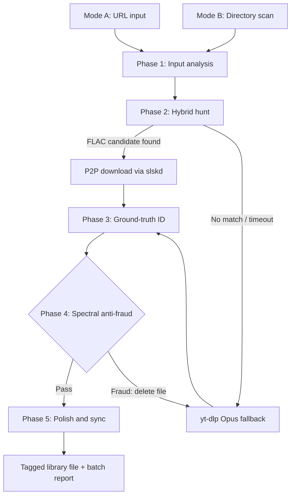

# OmniRip

**OmniRip** — a desktop TUI (Python 3.11+ / Textual) that acquires the best
available audio for a track using a **P2P-first (Soulseek via slskd), stream-fallback (yt-dlp)**
strategy, verifies authenticity with **audio fingerprinting** and **spectral anti-fraud
analysis**, and finishes every file with **canonical metadata + cover art**.

## Status

🚧 **M6 + M7 complete — TUI hardened, ready to ship.** The UI now drains pipeline events
through a throttled bridge (coalesced to ≤ 8 flushes/s, render-hash diffing, 500-row cap),
a level-filtered log console (`l` cycles INFO → DEBUG → WARN+ERROR), quit/purge/playlist/
first-run confirm modals, `Ctrl+P` mode toggle, a live slskd status worker, and a
worker-crash banner. Playlist URLs expand into capped, confirmed child jobs (D10).
First-run acceptance persists to the config file. M7 adds a GitHub Actions CI matrix
(Python 3.11/3.12 × ubuntu/macos, ruff + pytest with an 80% core-coverage gate), this
quick-start, and a `CHANGELOG.md`. Core coverage (analysis/pipeline/batch/util) is 85%.
An end-to-end smoke run still requires the slskd daemon, local `ffmpeg`/`ffprobe`, and a
real AcoustID key; missing components are reported instead of hidden. The original brief
is preserved in `Mp3 downloader.pdf`; the implementation guidance is in `docs/`.

**Next step:** harden and ship — see M6/M7 in [`docs/10-roadmap.md`](docs/10-roadmap.md).

## Quick start

1. **Install runtime dependencies** (macOS shown):
   ```sh
   brew install ffmpeg yt-dlp chromaprint
   ```
   `chromaprint` provides `fpcalc`. `ffmpeg` and `yt-dlp` are required; `fpcalc` enables
   fingerprinting (Phase 3 degrades gracefully without it).

2. **Install harvester** (from this checkout):
   ```sh
   uv sync --extra dev   # runtime + dev tooling
   # or: pip install -e .
   ```

3. **Configure** — copy `config.example.toml` to your data directory's `config.toml`, or just
   run and set keys via environment variables:
   ```sh
   export SLSKD_API_KEY="<your slskd key>"      # optional (P2P hunt)
   export ACOUSTID_API_KEY="<your AcoustID key>" # optional (metadata)
   OmniRip
   ```

4. **Run the test suite** (developers):
   ```sh
   uv run ruff check src tests
   uv run pytest --cov=harvester.analysis --cov=harvester.pipeline \
     --cov=harvester.batch --cov=harvester.util --cov-fail-under=80 -q
   ```

## OmniRip launcher

From this checkout, `./OmniRip` reads the ignored `tools/slskd/slskd.local.yml`, starts slskd
when it is not already running, exports the matching API key, and launches the TUI. This means
you normally need only one terminal. To use the command from any directory, add this alias to
`~/.zshrc`:

```sh
alias OmniRip='/Users/abdullahbinmadhi/Desktop/OmniRip/OmniRip'
```

Then reload your shell with `source ~/.zshrc`. The project folder was renamed to
`~/Desktop/OmniRip`, so the checkout path no longer contains spaces and a plain alias works.

## Acquisition policies

Configure these under `[slskd]` in `config.toml`:

- `best_available` (default): try P2P, reject peers above `max_queue_length`, then fall back.
- `lossless_preferred`: try P2P and prefer a validated FLAC; fall back after `p2p_timeout_s`.
- `fast_fallback`: skip P2P and use yt-dlp immediately.
- `highest_quality_mp3`: skip P2P and produce the configured MP3 output directly.

`max_queue_length = 5` prevents waiting behind a long Soulseek queue, and `p2p_timeout_s = 30`
bounds the search phase. A 320 kbps MP3 transcoded from a lossy stream does not restore lost
quality; choose `lossless_preferred` when source quality matters.

## What it does

Two entry modes feed one 5-phase asynchronous pipeline:

- **Mode A — Single URL:** paste a YouTube/streaming link → extract metadata → hunt a true
  FLAC on Soulseek → on timeout/no peers, fall back to the best Opus stream.
- **Mode B — Local Batch Audit:** point at a music directory → skip lossless and high-bitrate
  lossy files → queue the rest for upgrade through the same pipeline → atomically replace
  originals (old files preserved in `.trash/`).



Phase 4 only applies to **P2P files claiming lossless quality** — fallback streams have known
lossy provenance and skip it (see Decision D3 in `docs/01-requirements.md`).

## Documentation map

| # | Document | Purpose |
|---|----------|---------|
| — | [README.md](README.md) | This file — overview and index |
| 01 | [Requirements](docs/01-requirements.md) | Functional/non-functional requirements, resolved ambiguities, acceptance criteria, scope, legal note |
| 02 | [Architecture](docs/02-architecture.md) | Package layout, concurrency model, data model, state machine, config, logging |
| 03 | [Pipeline Phases](docs/03-pipeline.md) | Detailed spec of the 5 phases: inputs, outputs, timeouts, failure paths |
| 04 | [Spectral Anti-Fraud](docs/04-spectral-antifraud.md) | The FFT cutoff/brick-wall detection algorithm, parameters, verdicts, test fixtures |
| 05 | [Fingerprinting & Metadata](docs/05-fingerprinting-metadata.md) | fpcalc, AcoustID, MusicBrainz, cover art, mutagen tagging conventions |
| 06 | [slskd Integration](docs/06-slskd-integration.md) | Soulseek daemon setup, REST flow, candidate scoring, resilience |
| 07 | [yt-dlp Fallback](docs/07-ytdlp-fallback.md) | Subprocess strategy, format selection, progress parsing, failure catalog |
| 08 | [TUI Design](docs/08-tui-design.md) | Textual layout, widgets, event flow, throttling, keybindings |
| 09 | [Resilience & Testing](docs/09-resilience-testing.md) | Error taxonomy, retries, circuit breaker, timeout registry, test plan |
| 10 | [Roadmap](docs/10-roadmap.md) | Milestones M0–M7 with acceptance criteria |
| 11 | [Enhanced Prompt](docs/11-enhanced-prompt.md) | Self-contained, copy-paste build prompt for a coding assistant |

**Suggested reading order for implementers:** 01 → 02 → 03, then the service docs (04–08)
as each phase is built, with 09–10 as the delivery plan.

## System dependencies at a glance

| Dependency | Role | Required |
|------------|------|----------|
| Python ≥ 3.11 | Runtime | ✅ |
| FFmpeg + ffprobe | Decode, transcode, probe | ✅ (app degrades loudly without it) |
| yt-dlp | Stream extraction / fallback | ✅ |
| fpcalc (Chromaprint) | Audio fingerprinting | ✅ for Phase 3 |
| slskd daemon | Soulseek P2P access | ⚠️ optional — app runs in yt-dlp-only mode without it |
| AcoustID API key | Canonical metadata lookup | ⚠️ free, user must register |
| MusicBrainz / Cover Art Archive | Release info, album art | ⚠️ free, no key |

Full setup instructions: [`docs/11-enhanced-prompt.md`](docs/11-enhanced-prompt.md) §Setup and
the architecture doc's configuration section.

## Legal & ethical note

This tool is specified for **personal use** with content you are legally entitled to obtain
(your own works, public-domain or Creative Commons material, or purchases/rips you already own
where local law permits format-shifting). Downloading from YouTube generally violates its Terms
of Service, and sharing copyrighted material on P2P networks is illegal in many jurisdictions.
The documentation flags this where relevant; responsibility for compliant use lies with the
operator. Nothing here is intended to circumvent DRM.
