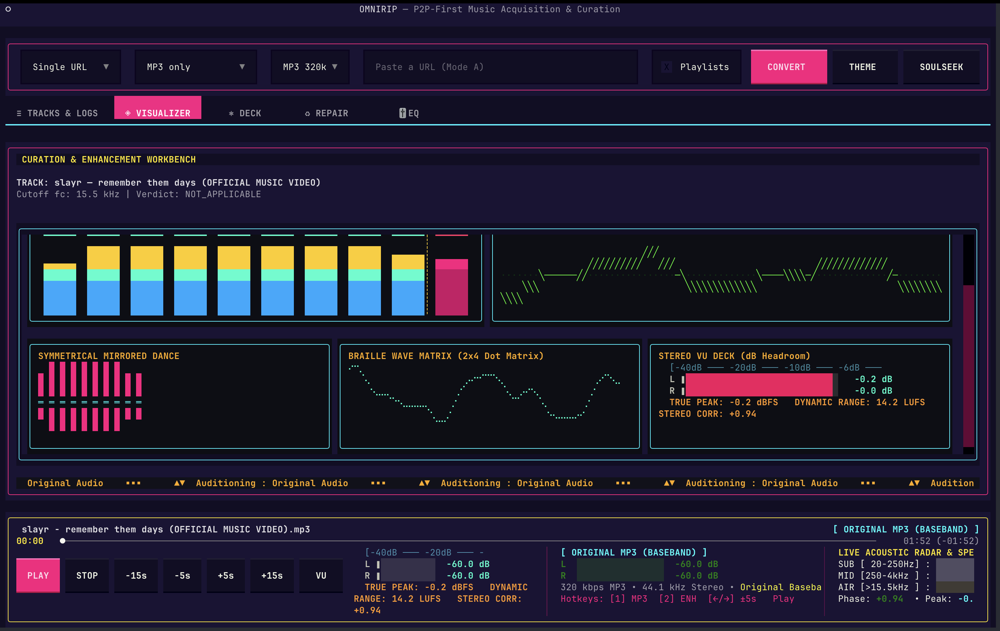
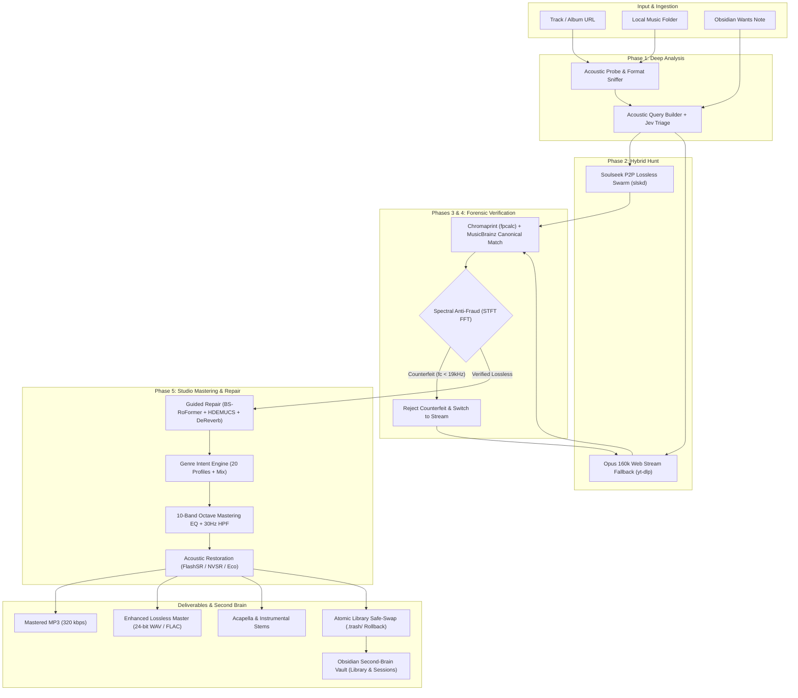
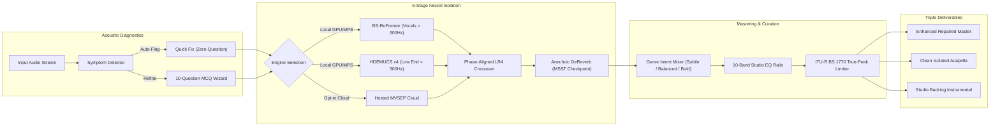
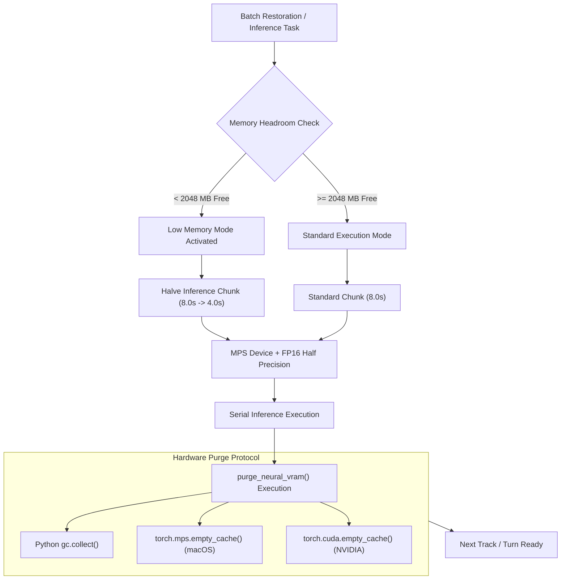
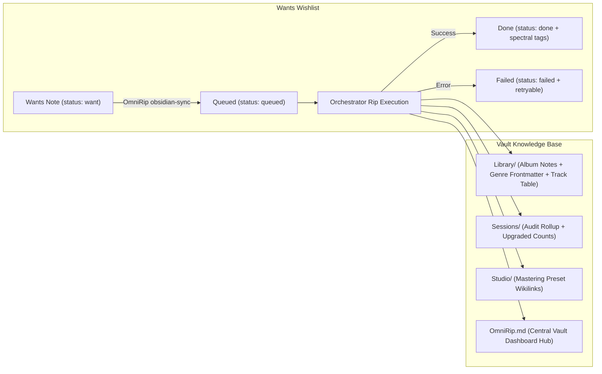
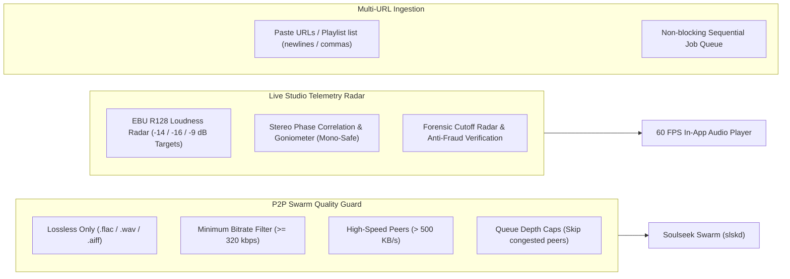

<div align="center">

<!-- 1. IMAGE FIRST (User Terminal Screenshot) -->
<p align="center">
  
</p>

<!-- 2. VIDEO BELOW IT (User Screen Recording Video / Demo) -->
<p align="center">
  <a href="https://github.com/abdullah-binmadhi/OmniRip/raw/main/docs/assets/omnirip_demo.mp4" title="Click to watch or download the full 1080p demo video with sound">
    
  </a>
</p>

```
 ██████╗ ███╗   ███╗███╗   ██╗██╗██████╗ ██╗██████╗ 
██╔═══██╗████╗ ████║████╗  ██║██║██╔══██╗██║██╔══██╗
██║   ██║██╔████╔██║██╔██╗ ██║██║██████╔╝██║██████╔╝
██║   ██║██║╚██╔╝██║██║╚██╗██║██║██╔══██╗██║██╔═══╝ 
╚██████╔╝██║ ╚═╝ ██║██║ ╚████║██║██║  ██║██║██║     
 ╚═════╝ ╚═╝     ╚═╝╚═╝  ╚═══╝╚═╝╚═╝  ╚═╝╚═╝╚═╝     
```

### ⚡ Sound, Uncompromising. Handcrafted for your Terminal. ⚡
*The hybrid P2P audiophile workstation with real-time studio mastering, neural repair & spectral anti-fraud defense.*

<br/>

<p align="center">
  <a href="https://github.com/abdullah-binmadhi/OmniRip/actions/workflows/ci.yml"></a>
  <a href="https://github.com/abdullah-binmadhi/OmniRip/raw/main/docs/assets/omnirip_demo.mp4"></a>
  <a href="#quick-start"></a>
  <a href="#mastering-workbench--10-band-studio-eq"></a>
  <a href="#genre-intent-engine-m20"></a>
  <a href="#lossless-24-bit-masters-m19"></a>
  <a href="#neural-ensemble--guided-repair-m18"></a>
  <a href="#obsidian-second-brain-sync-m23"></a>
  <a href="#m2-16gb-ram-hardening-m24"></a>
  <a href="https://github.com/astral-sh/uv"></a>
</p>

</div>

---

## 🕹️ Live Terminal Session Preview

```text
╭─ ~/OmniRip ──────────────────────────────────────────────────────── (main) ─╮
│ $ omnirip "https://open.spotify.com/track/4cOdK2wGLETKBW3PvgPWqT"           │
│                                                                             │
│ [13:24:01] 🔍 PROBE: Identified 'Rick Astley - Never Gonna Give You Up'     │
│ [13:24:02] ⚡ SLSK: Connected to Soulseek swarm · 48 peer candidates        │
│ [13:24:03] 📥 ACQUIRE: Selected peer 'AudiophileKing' [FLAC, 1411kbps, 0Q] │
│ [13:24:06] 🔬 SPECTRAL: Running 2048-pt STFT anti-fraud verification...     │
│ [13:24:07] ✦ RESULT: Valid lossless studio master (fc = 22.05 kHz) [PASS]  │
│ [13:24:08] ◈ GENRE INTENT: Detected 'Pop / Dance' → Composed EQ curve       │
│ [13:24:09] 🎚️ MASTERING: 10-band octave rails applied · +1.5dB Air @ 16kHz  │
│ [13:24:10] ▥ EXPORT: 24-bit 48kHz FLAC master saved to library/             │
│ [13:24:11] 📓 OBSIDIAN: Wants note updated → Library/Rick Astley/Album.md   │
│                                                                             │
│ ✔ ALL PIPELINE PHASES COMPLETE (0 errors, 0 dropped frames)                 │
╰─────────────────────────────────────────────────────────────────────────────╯
```

---

## 🚀 Welcome to the Future of Terminal Audio

Every once in a while, a tool comes along that completely transforms how you experience music.

For decades, digital music listening has meant making frustrating compromises:
- **Squashed Streaming Audio:** Streaming services crush dynamic range with lossy codecs to minimize cellular bandwidth.
- **Fake Lossless Scams on P2P:** Downloading music from peer-to-peer networks often leads to unpleasant surprises: "lossless FLAC" files that are actually muffled 128 kbps MP3s upsampled by internet tricksters.
- **Clunky DAWs for Basic Repairs:** Removing sibilance, room echo, or extracting acapellas previously required massive, expensive digital audio workstations.

**OmniRip solves all of this inside your terminal.** Built with Python 3.11+, Textual, NumPy, and modern PyTorch models, OmniRip is a cyberpunk command center combining decentralized P2P acquisition, mathematical forensic anti-fraud analysis, an interactive 10-band vertical mastering desk, 20-genre intent shaping, and deep-learning stem isolation.

---

## 🎛️ The Eight Pillars of OmniRip



---

### 1. Soulseek Lossless Hunt & Opus Stream Fallback
- **Intelligent Peer Scoring:** Scores swarm peers by bandwidth speed, file format (FLAC/WAV over MP3), and transfer queue depth in milliseconds.
- **Bounded Queue Timeouts:** If a peer queue is congested or stalls, OmniRip instantly shifts to an **Opus 160 kbps web stream** via `yt-dlp` so you never wait indefinitely.
- **Batch Directory Audits:** Point OmniRip at your music collection. It catalogs low-bitrate tracks, hunts down lossless upgrades across P2P swarms, and swaps them in safely.

### 2. Spectral Anti-Fraud: The Counterfeit Hunter
- **2048-Point STFT Analysis:** Math doesn't lie. OmniRip calculates the exact frequency cutoff ($f_c$) across the audible spectrum (20 Hz to 22.05 kHz).
- **Brick-Wall Detection:** Detects low-bitrate MP3 compression artifacts (128 kbps cut at 15 kHz; 192 kbps at 16 kHz; 256 kbps at 19 kHz).
- **Immediate Discard:** Fake high-res files are caught, rejected, and replaced with clean verified fallback audio.

---

### 3. Mastering Workbench & 10-Band Studio EQ
- **13-Line Vertical Fader Rails:** Standard octave bands: **31 Hz, 63 Hz, 125 Hz, 250 Hz, 500 Hz, 1 kHz, 2 kHz, 4 kHz, 8 kHz, and 16 kHz**. Adjust gain from $-12.0\text{ dB}$ to $+12.0\text{ dB}$ in precise $2.0\text{ dB}$ increments.
- **Zero-Latency Live Playback DSP:** Real-time filter auditioning across **`[1] ♫ MP3`** (Baseband), **`[2] ✦ ENH`** (Restored Derivative), or isolated stems with <50 ms latency.
- **Target-Aware Banks:** Independent EQ memory for `MASTER`, `VOCALS`, and `INSTRUMENTAL` targets, baked directly into final exported deliverables.
- **Acoustic Protection:** Switchable **30 Hz High-Pass Filter** prevents sub-sonic DC offset, while **Output Trim** guarantees distortion-free listening.

---

### 4. Genre Intent Engine (M20)
- **20 Granular Mastering Profiles:** Hip-Hop/Trap, Drill/UK, R&B/Soul, Pop, House, Techno, Trance/Progressive, Bass/Dubstep/DnB, Rock, Metal, Punk, Indie/Alt, Jazz, Classical/Orchestral, Acoustic/Folk, Country, Reggae/Dancehall, Latin/Reggaeton, Lo-fi/Chill, Ambient/Drone + Neutral.
- **Multi-Genre Blending:** Blend up to 6 genres simultaneously with weighted harmonic averaging (conflicting moves cancel out cleanly).
- **Three Intensity Levels:** **Subtle (0.6×)**, **Balanced (1.0×)**, and **Bold (1.4×)**.
- **150+ Tag Aliases:** Automatic tag resolution from ID3, ffprobe, and non-blocking background MusicBrainz queries.

---

### 5. Lossless 24-Bit Masters (M19)
- **WAV & FLAC Deliverables:** Beside default 320 kbps MP3s, export 24-bit 48 kHz studio masters through the exact same render and EQ chain.
- **Embedded Provenance:** Embeds `DERIVED_FROM_LOSSY=true`, `SYNTHETIC_HIGH_BAND=true`, applied preset, and genre metadata in FLAC Vorbis comments and WAV ID3 TXXX frames.

---

### 6. Neural Ensemble & Guided Repair (M18)



- **Dual-Model Ensemble:** **BS-RoFormer** handles vocal clarity (>300 Hz) while **HDEMUCS v4** anchors punchy low end (<300 Hz).
- **Phase-Aligned LR4 Crossover:** Zero-phase 24 dB/octave Linkwitz-Riley filter delivers a completely flat 0 dB sum response.
- **Anechoic MSST De-Reverb:** Neural checkpoint separates dry vocals from diffuse room reflections.
- **Guided Repair Wizard:** Zero-question Quick Fix derived from acoustic detection, 10-question diagnostic interview, and section-specific repair ranges (`min:sec` with auto-suggested hot-spots).
- **Three Deliverables:** Output an enhanced repaired master, clean acapella, and studio backing track.

---

### 7. 7-Mode Real-Time Visualizer (M22)
Press <kbd>v</kbd> to cycle between seven responsive Unicode visualizers:
1. **Waveform (`waveform`):** Time-domain stereo amplitude oscilloscope.
2. **Spectrum (`spectrum`):** 32-band real-time FFT energy bars.
3. **Stereo VU Meters (`vu`):** Dual-channel average signal levels with peak holds.
4. **Peak Meters (`peak`):** High-precision dynamic range and clipping indicators.
5. **Vectorscope (`vectorscope`):** Polar stereo soundstage width and balance scope.
6. **STFT Spectrogram Waterfall (`spectrogram`):** 2D time-frequency density waterfall with high-frequency cutoff line overlay (`cutoff_hz`).
7. **Stereo Lissajous Phase Scope (`phase_scope`):** Real-time phase correlation meter (-1.0 to +1.0), stereo width percentage, and mono-cancellation warning alerts.

---

### 8. Batch Auto-Restoration & Curation (M21)
- **Serial Walk:** Traverses directory trees while skipping `.trash/` and hidden folders.
- **Acoustic & Genre Policy:** Probes bitrates, identifies genres, applies composed mastering curves, and renders enhanced audio.
- **Atomic Safe-Swap:** Moves original files to `<root>/.trash/<YYYY-MM-DD>/<HHMMSS>-<name>` and atomically swaps enhanced files into place with automatic rollback upon any OS error.
- **Markdown Reporting:** Generates structured Markdown summary tables detailing codec, bitrate, cutoff, applied genre preset, and restoration status.

---

### 9. Apple Silicon & 16GB RAM Hardening (M24)



- **Dynamic Chunk Sizing:** Standard 8.0s inference chunks dynamically shrink to 4.0s when system memory headroom drops below 2048 MB.
- **MPS & FP16 Acceleration:** Employs Metal Performance Shaders with half-precision floating point (`float16`), cutting resident model allocations by 50%.
- **VRAM Purge Protocol:** Every render, export, and batch iteration executes `purge_neural_vram()`, flushing MPS/CUDA buffers and running garbage collection to eliminate swap memory spikes.

---

### 10. Obsidian Second-Brain Sync (M23)



- **Wants As Wishlist:** Place notes in `Wants/` with frontmatter `status: want`. OmniRip imports them, rips lossless candidates, and updates status to `done` with spectral tags (`spectral PASS @ 21500Hz`).
- **Rich Library Notes:** Exports structured album notes under `Library/<Artist>/<Album>.md` with YAML frontmatter genres, track counts, release years, and track tables with genre columns.
- **Central Dashboard:** Generates `OmniRip.md` as your personal second-brain music hub.

---

### 11. Studio Telemetry Radar & Smart Quality Filters



- **Live EBU R128 Loudness Radar (`LUFS` Mode):** Real-time momentary bar meter and delta readout comparing playback energy against professional streaming target standards:
  - **`-14 LUFS`** (Spotify / YouTube / Tidal)
  - **`-16 LUFS`** (Apple Music / Podcasts / AES TD1004)
  - **`-9 LUFS`** (Club / Commercial High-Energy EDM)
- **Stereo Goniometer & Phase Vectorscope (`PHASE` Mode):** Live phase correlation bar (`[-1.0 .. +1.0]`) with mono-compatibility warnings and expandable Mid/Side energy spread calculations.
- **Forensic Spectral Health (`RADAR` Mode):** Instant visual readout of high-frequency cutoff points, Nyquist bandwidth retention percentage, and anti-fraud authenticity verdicts (`VERIFIED TRUE LOSSLESS` vs `TRANSCODE FAKE`).
- **Tactical Hotkeys & Cheatsheet (<kbd>?</kbd>):**
  - Press <kbd>?</kbd> to open the in-app interactive keyboard cheatsheet overlay.
  - Press <kbd>t</kbd> to cycle telemetry modes (`LUFS` ➔ `PHASE` ➔ `RADAR`).
  - Press <kbd>T</kbd> / <kbd>Shift+T</kbd> to cycle loudness reference targets.
  - Press <kbd>p</kbd> or click the radar directly to reset peak-hold meters.
- **Multi-URL Batch Downloader:** Paste dozens of Spotify/YouTube links or search terms into the input box separated by commas, semicolons, or newlines for automated sequential acquisition.

---

## ⚡ Quick Start (1-Command Install)

### 🚀 Instant Install & Run

Copy and run **one command** in your terminal:

**macOS & Linux (1-Command):**
```sh
curl -fsSL https://raw.githubusercontent.com/abdullah-binmadhi/OmniRip/main/install.sh | bash
```

**macOS (via Homebrew):**
```sh
brew install abdullah-binmadhi/tap/omnirip
```

**Windows (PowerShell 1-Command):**
```powershell
irm https://raw.githubusercontent.com/abdullah-binmadhi/OmniRip/main/install.ps1 | iex
```

**Standalone Zero-Dependency Binaries:**
Download precompiled single-file binaries directly from [GitHub Releases](https://github.com/abdullah-binmadhi/OmniRip/releases):
- `omnirip-macos-arm64` (Apple Silicon M1/M2/M3/M4)
- `omnirip-linux-x86_64` (Linux x86_64)
- `omnirip-windows-x64.exe` (Windows x64)

**Instant Zero-Install (via `uvx`):**
```sh
uvx --from git+https://github.com/abdullah-binmadhi/OmniRip.git omnirip
```

---

### 🎧 First-Run Setup & In-TUI Settings

OmniRip handles everything inside the TUI — **no editing config files or `.env` files required**:

1. **AI Model Auto-Downloader:** On first launch, OmniRip checks your local model cache. If stem separation (Demucs v4) or high-frequency restoration (FlashSR) weights are missing, a progress dialog appears to download and verify them automatically.
2. **In-TUI Settings & API Keys (`Ctrl+S` / `SETTINGS`):** Press `Ctrl+S` or click `SETTINGS` in the top bar to paste and test your credentials:
   - **Soulseek (`slskd`):** Enter your daemon URL and API key; click **Test Connections** to verify immediately.
   - **AcoustID:** Paste your application key for fingerprinting.
   - **Cloud AI (MVSEP / TypeSafe Jev):** Optional keys for cloud separation and smart triage.
   - **Obsidian Vault:** Set your vault directory for bidirectional second-brain syncing.

---

### 🛠️ Developer Manual Setup

For developers contributing to OmniRip:

```sh
git clone https://github.com/abdullah-binmadhi/OmniRip.git
cd OmniRip
uv sync --extra dev --extra restore --extra flashsr
uv run omnirip
```

> [!TIP]
> The `--extra restore` and `--extra flashsr` flags install PyTorch, Demucs, TorchAudio, Transformers, and FlashSR dependencies for on-device Neural Stem Separation and AI Super-Resolution. For lightweight installations without neural models, omit the flags to run in instant Eco DSP mode.

---

## 💻 CLI Commands & Automation

```sh
# Synchronize Obsidian vault (import Wants and export Library/Sessions/Studio)
OmniRip obsidian-sync

# Dry-run Obsidian sync without modifying notes
OmniRip obsidian-sync --dry-run

# Re-queue failed Wants notes
OmniRip obsidian-sync --retry-failed

# Enhance an individual audio file directly from CLI
OmniRip --enhance /path/to/song.mp3 --preset extended_air --bitrate 320k
```

---

## ⌨️ Studio Keyboard Shortcuts

| Key | Action | Description |
|:---:|:---|:---|
| <kbd>?</kbd> | **Command Cheatsheet** | Open full keyboard shortcuts & studio telemetry guide modal |
| <kbd>Space</kbd> | **Play / Pause** | Toggle real-time audio playback in the built-in studio player |
| <kbd>←</kbd> / <kbd>→</kbd> | **Seek Track** | Jump playback backward or forward ±5 seconds (or click scrubber directly) |
| <kbd>t</kbd> | **Telemetry Mode** | Cycle studio telemetry instrument: `LUFS` ➔ `PHASE` ➔ `RADAR` |
| <kbd>T</kbd> / <kbd>Shift+T</kbd> | **LUFS Target** | Cycle reference target: `-14 LUFS` (Spotify/YT) ➔ `-16` (Apple) ➔ `-9` (Club) |
| <kbd>p</kbd> | **Reset Peaks** | Clear peak hold and reset vectorscope drift to current baseline |
| <kbd>F1</kbd>–<kbd>F5</kbd> | **Page Navigation** | Switch studio pages: `[F1]` Tracks & Logs, `[F2]` Visualizer, `[F3]` Deck, `[F4]` Repair, `[F5]` EQ |
| <kbd>1</kbd> | **Audition [1] ♫ MP3** | Switch playback to Original MP3 Baseband stream with live 10-band EQ filtering |
| <kbd>2</kbd> | **Audition [2] ✦ ENH** | Switch playback to Enhanced Derivative stream with live 10-band EQ filtering |
| <kbd>w</kbd> | **Mastering Workbench** | Open the Curation & Enhancement Workbench to sculpt EQ, preview and export |
| <kbd>v</kbd> | **Cycle Visualizer** | Cycle between all 7 visualizer modes (Spectrogram, Phase Scope, Spectrum, etc.) |
| <kbd>g</kbd> | **Genre Intent Mix** | Open the 20-Genre Intent Mixer modal with intensity controls |
| <kbd>i</kbd> / <kbd>d</kbd> | **Info & Doctor** | Open the Track Info modal / system diagnostics doctor |
| <kbd>F5</kbd> | **Repair** | Guided Repair: Quick Fix, MCQ wizard, section ranges, Local/Hosted engine |
| <kbd>Ctrl</kbd>+<kbd>s</kbd> | **API Settings** | Open in-TUI credentials modal for Soulseek, AcoustID, and AI keys |
| <kbd>Ctrl</kbd>+<kbd>p</kbd> | **Toggle Mode** | Switch between URL Hunt (Single Track) and Local Batch Audit |
| <kbd>l</kbd> | **Log Cycle** | Cycle log telemetry levels: `INFO` → `DEBUG` → `WARN+ERROR` |
| <kbd>e</kbd> | **Export Master** | Export enhanced master (320 kbps MP3, or 24-bit WAV/FLAC from Deck menu) |
| <kbd>q</kbd> | **Quit** | Gracefully disconnect P2P sessions and exit the workstation |

---

## 📊 Technical Specifications

| Component | Technology | Specification |
|:---|:---|:---|
| **Runtime** | Python ≥ 3.11 | Pure asynchronous event-driven core (`asyncio`) |
| **Interface** | Textual TUI | 60 FPS reactive engine, Cyberpunk Neon & Monokai themes |
| **P2P Transport** | Soulseek (`slskd`) | REST client with queue guards and candidate scoring |
| **Stream Engine** | `yt-dlp` | Adaptive format prioritization (`bestaudio[ext=webm]`) |
| **Forensic DSP** | NumPy + SciPy | 2048-point STFT, Hanning window, -60 dBFS noise floor |
| **Mastering EQ** | FFmpeg Live Filter | 10-band octave parametric filters (`width_type=o:w=1`), target banks |
| **Genre Engine** | DSP Curves + Aliases | 20 profiles, 150+ aliases, multi-genre mix, weighted curve averaging |
| **Lossless Exports**| FFmpeg + Mutagen | 24-bit 48 kHz WAV (ID3 TXXX) & FLAC (Vorbis provenance comments) |
| **Neural Ensemble** | BS-RoFormer + HDEMUCS | 5-stage pipeline, zero-phase LR4 crossover, MSST de-reverb |
| **Guided Repair** | Acoustic Fingerprints | Quick Fix, 10-question MCQ wizard, section ranges, Local/Hosted MVSEP |
| **Visualizer** | 7-Mode Terminal Engine | Spectrogram waterfall, stereo Lissajous phase scope, spectrum, VU meters |
| **Batch Engine** | `harvester.batch` | Serial walk, safe atomic swap with `.trash/` rollback, Markdown reports |
| **Memory Engine** | `harvester.util.memory`| MPS FP16 acceleration, dynamic chunk scaling, automatic `purge_neural_vram()` |
| **Second Brain** | Obsidian Sync API | 2-way sync, Wants wishlist queue, album notes, Studio preset links |
| **Fingerprinting**| Chromaprint (`fpcalc`) | AcoustID audio fingerprinting + MusicBrainz API |
| **Tagging** | Mutagen | Complete ID3v2.4 unicode provenance tagging + album art |

---

## 📜 Legal & Ethical Architecture

OmniRip is designed exclusively for **personal curation, format-shifting, and acoustic restoration** of content you are legally entitled to obtain (original purchases, your own creations, public domain records, and Creative Commons material). 

OmniRip does not bypass digital rights management (DRM) or circumvent access controls. Operators are responsible for complying with local copyright regulations and platform terms of service.

---

<p align="center">
  <strong>Crafted with obsession for pure sound.</strong><br>
  OmniRip © 2026. Distributed under the MIT License.
</p>
