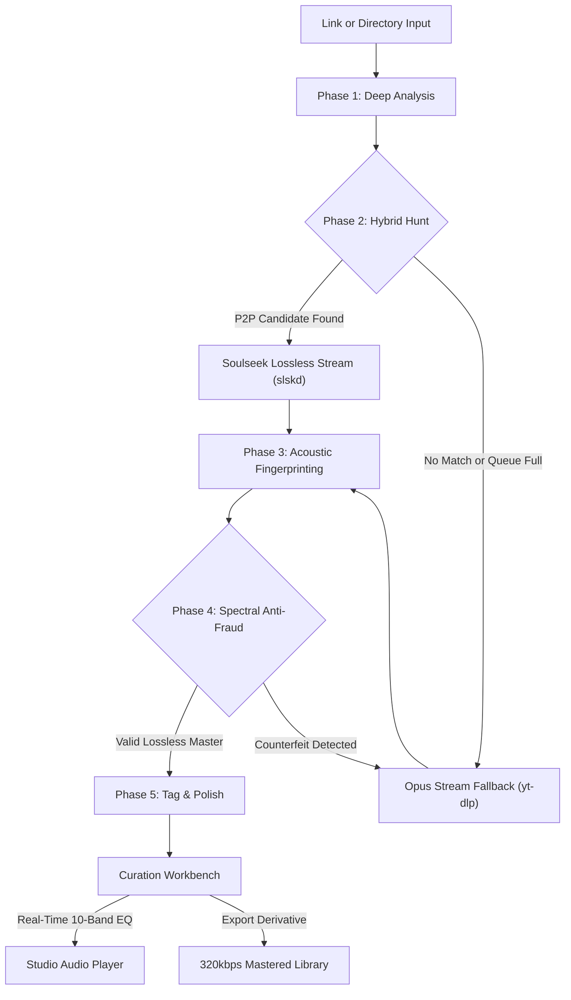

<p align="center">
  <a href="https://github.com/abdullah-binmadhi/OmniRip/raw/main/docs/assets/omnirip_demo.mp4" title="Click to watch or download the full 1080p video demo with sound">
    
  </a>
</p>
<p align="center">
  
</p>

<h1 align="center">OmniRip</h1>

<p align="center">
  <strong>Sound, uncompromising. Handcrafted for your terminal.</strong><br>
  <em>The hybrid P2P audiophile workstation with real-time studio mastering and spectral fraud defense.</em>
</p>

<p align="center">
  <a href="https://github.com/abdullah-binmadhi/OmniRip/raw/main/docs/assets/omnirip_demo.mp4"></a>
  <a href="#quick-start"></a>
  <a href="#the-curation-workbench--10-band-studio-equalizer"></a>
  <a href="#spectral-anti-fraud-intelligence"></a>
  <a href="https://github.com/astral-sh/uv"></a>
</p>

---

## Say hello to OmniRip.

Every once in a while, a tool comes along that completely redefines the way we interact with sound.

For decades, digital audio has been a tale of frustrating trade-offs. You either accept heavily compressed, lossy streams flattened by web algorithms, or you lose hours wrestling with clunky P2P interfaces, only to realize your downloaded "FLAC" was just a transcoded 128 kbps MP3 wrapped in an expensive file extension.

**OmniRip changes everything.**

Built from the ground up for musicians, archivists, and unapologetic audiophiles, OmniRip combines the raw hunting power of **Soulseek P2P** and **adaptive stream fallbacks** with real-time **spectral forensic analysis**, a **10-band studio mastering equalizer**, and non-destructive **harmonic excitation**. All inside a breathtaking, keyboard-driven terminal console.

It’s not just a downloader. It’s an audio preservation studio in your shell.

---

## Five Pillars of Audio Perfection

```
           ┌───────────────────────────────────────────────────────────┐
           │                     THE OMNIRIP ENGINE                    │
           └─────────────────────────────┬─────────────────────────────┘
                                         │
     ┌───────────────────┬───────────────┴───────────────┬───────────────────┐
     ▼                   ▼                               ▼                   ▼
[ 1. P2P HUNT ]   [ 2. ANTI-FRAUD ]              [ 3. REALTIME EQ ]   [ 4. RESTORATION ]
Soulseek Lossless  Spectral FFT                   10-Band Mastering    Sub-fc Invariant
 + Stream Fallback Verification                    Dual-Stream DSP      Harmonic Exciter
```

### 1. P2P-First Architecture: Lossless Without Compromise
Why settle for lossy web compression when you can have the original studio master?
- **Intelligent Peer Scoring:** Evaluates bitrate, transfer speed, peer queue depth, and file structure in milliseconds.
- **Queue Guard & Bounded Timeouts:** Never get stuck behind a 200-person Soulseek queue. If high-speed lossless peers aren’t immediately available, OmniRip gracefully transitions to the highest-fidelity Opus stream fallback via `yt-dlp`.
- **Atomic Library Upgrades:** Run it against a single track URL or audit an entire music folder. OmniRip spots low-bitrate rips, hunts superior masters, and atomically swaps them into your library with zero downtime.

### 2. Spectral Anti-Fraud Intelligence: Truth You Can See
Anyone can rename an MP3 to `.flac`. Fake lossless files plague the internet. OmniRip doesn't take filenames on faith:
- **Instantaneous FFT Spectrogramming:** Measures harmonic energy across the Nyquist frequency spectrum.
- **Brick-Wall Cutoff Detection:** Identifies telltale compression walls at 15 kHz (128 kbps), 16 kHz (192 kbps), and 19 kHz (256 kbps).
- **Zero Tolerance for Upsampled Impostors:** If a candidate claiming to be a FLAC is detected as an upsampled fake, OmniRip immediately purges the imposter and re-routes to a verified fallback.

### 3. The Curation Workbench & 10-Band Studio Equalizer
A professional mastering desk inside your terminal. Tweak, audition, and sculpt in real time:
- **Precision 13-Line Studio Fader Rails:** Spans $-12.0\text{ dB}$ to $+12.0\text{ dB}$ in exact $2.0\text{ dB}$ increments, featuring yellow unity gain markers (`─┼─`), $\pm 6\text{ dB}$ calibration ticks, and dynamic illuminated thumbs (`─█─`).
- **Zero-Latency Live DSP Playback:** Live FFmpeg audio filtering applies instantly across **both** `[1] ♫ MP3` and `[2] ✦ ENH` streams. When you boost the sub-bass at 31 Hz or lift the air at 16 kHz, you hear the difference in your headphones in under 50 milliseconds.
- **Acoustic Presets at a Click:** Instant toggle between *Club Punch*, *Vocal Clarity*, *Hi-Fi Air*, *Warm Vinyl*, and *De-Mud*, plus dedicated 30 Hz High-Pass Filtering (HPF) and Output Trim.

### 4. Acoustic Restoration: Pure Non-Destructive Magic
For rare historical tracks, demos, and vinyl rips where no lossless master exists:
- **Sub-$f_c$ Passband Invariance:** Audio below the detected compression cutoff $f_c$ is strictly bit-preserved. OmniRip never alters the original master baseband.
- **Deterministic Harmonic Excitation:** Generates natural high-frequency overtones and air (>15 kHz) using linear-phase crossovers, progressive mono bass stabilization (<100 Hz), and ITU-R BS.1770 true-peak limiting.
- **Dual Engine Choice:** Toggle between lightning-fast **Eco Mode** (zero-heat, pure NumPy DSP) and **Neural Mode** (AI-powered deep residual models).

### 5. Canonical Fingerprinting & Immaculate Tagging
- **AcoustID Audio Fingerprinting:** Generates true acoustic fingerprints (`fpcalc`) to query MusicBrainz for canonical track titles, artist credits, release dates, and track numbers.
- **Embedded Cover Art:** Ingests high-resolution cover artwork from the Cover Art Archive directly into ID3v2 tags.
- **Clean Naming Conventions:** Say goodbye to `track_01_final_v2_1080p.mp3`. Hello to perfection.

---

## Interactive Architecture Flow



---

## Quick Start

Experience OmniRip in less than two minutes.

### 1. Prerequisites (macOS shown)
```sh
brew install ffmpeg yt-dlp chromaprint
```

### 2. Install OmniRip
Clone the repository and install using `uv` (recommended) or `pip`:
```sh
git clone https://github.com/abdullahbinmadhi/OmniRip.git
cd OmniRip
uv sync --extra dev
```

### 3. Launch the Studio
Launch the unified TUI:
```sh
./OmniRip
```

> [!TIP]
> **One-Command Daemon Integration:** The `./OmniRip` launcher automatically reads local Soulseek credentials from `tools/slskd/slskd.local.yml`, boots the daemon if it’s offline, connects to the P2P swarm, and opens the TUI in a single terminal.

---

## Keyboard-Driven Studio Mastery

OmniRip is designed for terminal velocity. Keep your hands on the home row:

| Key | Action | Description |
|:---:|:---|:---|
| <kbd>Space</kbd> | **Play / Pause** | Toggle real-time audio playback in the built-in studio player |
| <kbd>1</kbd> | **Audition MP3** | Switch playback to original stream with live EQ filtering |
| <kbd>2</kbd> | **Audition ENH** | Switch playback to restored master with live EQ filtering |
| <kbd>w</kbd> | **Workbench** | Open the Curation & Enhancement Mastering Workbench |
| <kbd>Ctrl</kbd>+<kbd>p</kbd> | **Toggle Mode** | Switch between URL Hunt (Single Track) and Local Batch Audit |
| <kbd>l</kbd> | **Log Cycle** | Cycle log telemetry: `INFO` → `DEBUG` → `WARN+ERROR` |
| <kbd>e</kbd> | **Export** | Download enhanced, mastered derivative directly to your library |
| <kbd>q</kbd> | **Quit** | Gracefully disconnect daemon sessions and exit |

---

## Tech Specs & System Architecture

| Component | Technology | Specification |
|:---|:---|:---|
| **Runtime** | Python ≥ 3.11 | Pure asynchronous event-driven core (`asyncio`) |
| **Interface** | Textual TUI | 60 FPS reactive engine, Cyberpunk Neon & Monokai themes |
| **P2P Transport** | Soulseek (`slskd`) | REST client with queue guards and peer scoring |
| **Stream Engine** | `yt-dlp` | Adaptive format prioritization (`bestaudio[ext=webm]`) |
| **Forensic DSP** | NumPy + SciPy | 2048-point STFT, Hanning window, -60 dBFS noise floor |
| **Mastering EQ** | FFmpeg Live Filter | 10-band octave parametric filters (`width_type=o:w=1`) |
| **Fingerprinting**| Chromaprint (`fpcalc`) | AcoustID audio fingerprinting + MusicBrainz API |
| **Tagging** | Mutagen | Complete ID3v2.4 unicode provenance tagging + album art |

---

## Documentation Deep Dive

For engineers and contributors exploring the internal mechanics:

| Document | Focus |
|:---|:---|
| 📘 [**01. Requirements & Scope**](docs/01-requirements.md) | Functional matrix, acceptance criteria, and edge cases |
| 🏗️ [**02. Core Architecture**](docs/02-architecture.md) | State machine, concurrency pipelines, and data models |
| 🔄 [**03. Pipeline Phases**](docs/03-pipeline.md) | In-depth walkthrough of the 5-phase asynchronous hunt |
| 🔬 [**04. Spectral Anti-Fraud**](docs/04-spectral-antifraud.md) | Mathematical cutoff algorithms and test fixtures |
| 🏷️ [**05. Metadata & Provenance**](docs/05-fingerprinting-metadata.md) | AcoustID, MusicBrainz, and mutagen tagging schemas |
| ⚡ [**06. slskd Integration**](docs/06-slskd-integration.md) | P2P daemon REST integration and candidate ranking |
| 📥 [**07. Stream Fallback**](docs/07-ytdlp-fallback.md) | yt-dlp subprocess strategies and error catalogs |
| 🎨 [**08. TUI Workstation Design**](docs/08-tui-design.md) | Textual widget hierarchy, event throttling, and layout |
| 🛡️ [**09. Testing & Resilience**](docs/09-resilience-testing.md) | Circuit breakers, retry policies, and test matrix |
| 🗺️ [**10. Project Roadmap**](docs/10-roadmap.md) | Milestones M0 through M10 |

---

## Legal & Ethical Architecture

OmniRip is designed exclusively for **personal curation, format-shifting, and acoustic restoration** of content you are legally entitled to obtain (original purchases, your own creations, public domain records, and Creative Commons material). 

OmniRip does not bypass digital rights management (DRM) or circumvent access controls. Operators are responsible for complying with local copyright regulations and platform terms of service.

---

<p align="center">
  <strong>Crafted with obsession for pure sound.</strong><br>
  OmniRip © 2026. Distributed under the MIT License.
</p>
