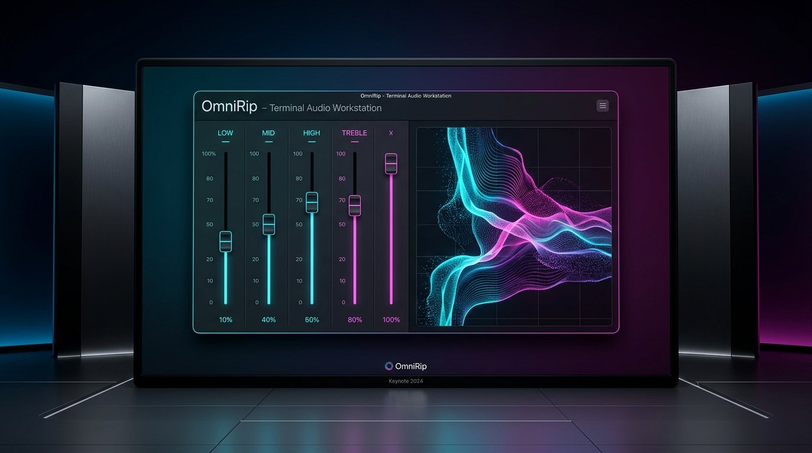
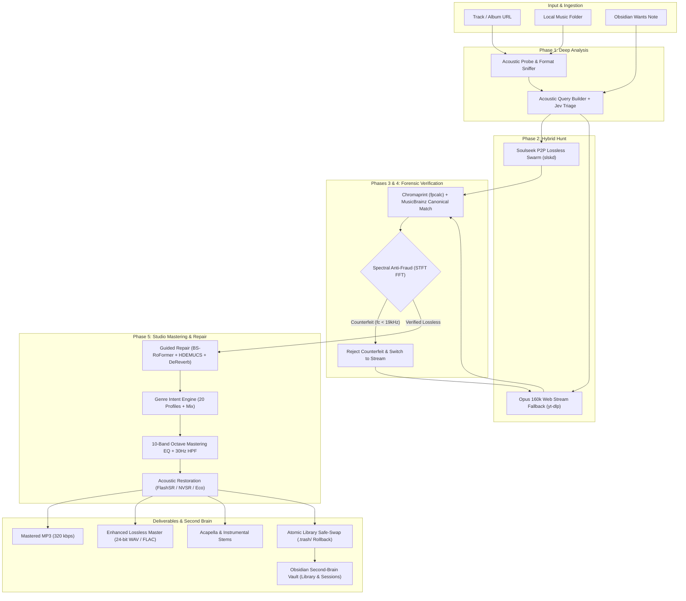
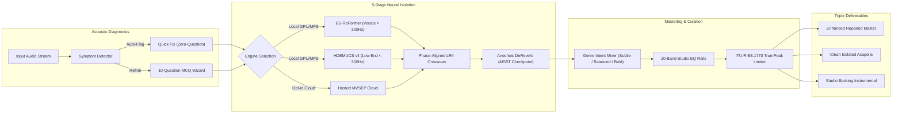
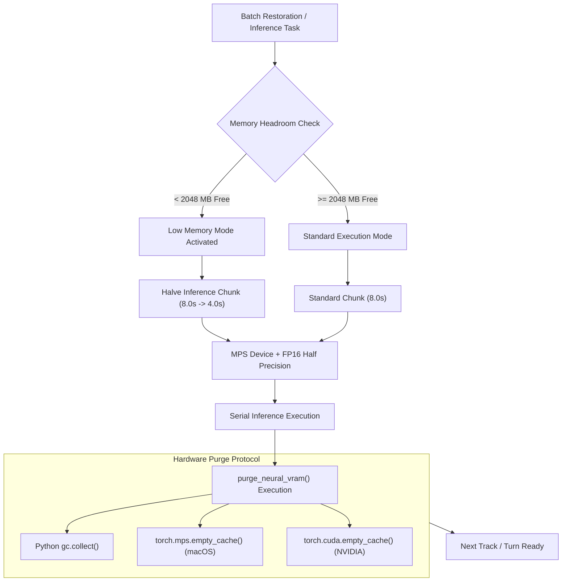
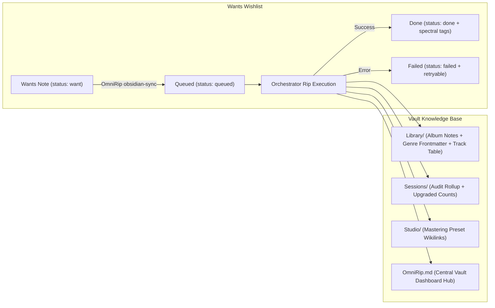

<p align="center">
  
</p>

<p align="center">
  <a href="https://github.com/abdullah-binmadhi/OmniRip/raw/main/docs/assets/omnirip_demo.mp4" title="Click to watch or download the full 1080p video demo with sound">
    
  </a>
</p>

<h1 align="center">OmniRip</h1>

<p align="center">
  <strong>Sound, uncompromising. Handcrafted for your terminal.</strong><br>
  <em>The hybrid P2P audiophile workstation with real-time studio mastering, neural repair, and spectral fraud defense.</em>
</p>

<p align="center">
  <a href="https://github.com/abdullah-binmadhi/OmniRip/actions/workflows/ci.yml"></a>
  <a href="https://github.com/abdullah-binmadhi/OmniRip/raw/main/docs/assets/omnirip_demo.mp4"></a>
  <a href="#quick-start"></a>
  <a href="#3-curation--enhancement-workbench-with-10-band-studio-equalizer"></a>
  <a href="#genre-intent-engine-d38"></a>
  <a href="#lossless-enhanced-masters-d37"></a>
  <a href="#5-neural-ensemble-separation--guided-repair-studio"></a>
  <a href="#obsidian-second-brain-integration"></a>
  <a href="#apple-silicon--16gb-ram-hardening"></a>
  <a href="https://github.com/astral-sh/uv"></a>
</p>

---

## Say hello to OmniRip.

Every once in a while, a tool comes along that completely changes how you listen to music.

For years, listening to digital music has meant making frustrating compromises. If you listen on streaming platforms, songs are often squashed and flattened by heavy compression algorithms so they stream faster over mobile data. And if you try searching peer-to-peer (P2P) file-sharing networks for original CD-quality audio, you often lose hours waiting in long download lines—only to find out that the "lossless FLAC" file you just downloaded was actually a muffled, low-quality 128 kbps MP3 that someone renamed to fool you.

**OmniRip changes everything.**

OmniRip is a complete, all-in-one music workstation designed right inside your terminal. Think of it as a smart music detective, an acoustic forensic auditor, and a professional mastering studio rolled into one fast, responsive app:
- **P2P Soulseek Hunt & Stream Fallback:** Searches decentralized swarms for original lossless audio, with instant fallback to clean 160 kbps Opus web streams.
- **Spectral Anti-Fraud Intelligence:** Employs high-resolution Short-Time Fourier Transform (STFT) algorithms to catch fake high-resolution files and compression brick-walls ($f_c$).
- **Curation Workbench & 10-Band Studio EQ:** 13-line vertical fader rails with zero-latency live playback filtering across standard octave bands.
- **Genre Intent Engine:** 20 granular mastering profiles (Hip-Hop/Trap, Drill, R&B, House, Techno, Jazz, Pop, Rock, Classical, Ambient, etc.) with weighted multi-genre curve blending and intensity scaling.
- **Lossless 24-bit Masters:** Exports master recordings directly to 24-bit 48 kHz WAV and FLAC with embedded provenance metadata tags.
- **Neural Ensemble Separation & Guided Repair:** Combines BS-RoFormer, HDEMUCS v4, and anechoic MSST De-Reverb with a zero-question Quick Fix and 10-question MCQ diagnostic wizard.
- **7-Mode Real-Time Visualizer:** Includes STFT Spectrogram Waterfalls with cutoff overlays and Stereo Lissajous Phase Scopes with correlation metering.
- **Batch Library Auto-Restoration:** Scans entire music directories, applies acoustic restoration, and executes crash-proof atomic file swaps with `.trash/` rollback safety.
- **Obsidian Second-Brain Integration:** Two-way sync with your personal vault (`OmniRip obsidian-sync`), converting wishlists into automated rip queues and formatting albums into Markdown knowledge bases.
- **Apple Silicon M2 / 16GB RAM Hardening:** Tailored specifically for fanless 16GB architectures with automatic MPS half-precision (FP16), chunk-size governors, serial batch processing, and explicit neural VRAM flushing (`purge_neural_vram()`).

---

## Live Studio Demonstration

<p align="center">
  
</p>

<p align="center">
  <em>The OmniRip Curation Workbench in action: 10-band octave mastering rails, real-time visualizer scope, dual-stream A/B auditioning, target banks, and genre intent controls.</em>
</p>

> [!TIP]
> **Watch the High-Definition Video Demo:**
> Download or view the full 1080p MP4 recording with live audio demonstration: [**`docs/assets/omnirip_demo.mp4`**](https://github.com/abdullah-binmadhi/OmniRip/raw/main/docs/assets/omnirip_demo.mp4).

---

## System Architecture



---

## Core Pillars of Audio Perfection

### 1. Soulseek Lossless Hunt & Opus Stream Fallback
Why settle for compressed web audio when you can have the original studio master?
- **Intelligent Peer Scoring:** When you paste a song link or track title, OmniRip connects to the Soulseek peer-to-peer network. In milliseconds, it inspects every user sharing the song and scores them based on upload speed, queue depth, and format (FLAC/WAV prioritized over 320k MP3).
- **Queue Guard & Bounded Timeouts:** If a peer's queue is congested or stalls, OmniRip gives a short countdown and automatically falls back to an **Opus 160 kbps stream** via `yt-dlp`. You never sit waiting for frozen transfers.
- **Atomic Library Upgrade:** Point OmniRip at a music folder. It audits low-bitrate rips, hunts lossless replacements, and atomically replaces files with zero risk of corruption.

### 2. Spectral Anti-Fraud Intelligence: The Counterfeit Hunter
Anyone can re-encode a 128 kbps MP3 into `.flac` and claim it is "studio lossless." OmniRip validates the actual physics of the audio:
- **Instantaneous STFT Spectrogramming:** Takes a mathematical snapshot across the entire audible spectrum, from 20 Hz sub-bass to 22.05 kHz treble.
- **Brick-Wall Cutoff Detection ($f_c$):** MP3 compression creates an abrupt brick-wall cutoff (128k cuts at 15 kHz, 192k cuts at 16 kHz, 256k cuts at 19 kHz). A genuine lossless FLAC has continuous harmonic content up to 22.05 kHz.
- **Zero Tolerance for Impostors:** Counterfeit lossless files are rejected on the spot, discarded, and replaced with clean verified fallback streams.

### 3. Curation & Enhancement Workbench with 10-Band Studio Equalizer
A professional mixing desk right inside your terminal console:
- **13-Line Vertical Fader Rails:** Standard octave bands: **31 Hz, 63 Hz, 125 Hz, 250 Hz, 500 Hz, 1 kHz, 2 kHz, 4 kHz, 8 kHz, and 16 kHz**. Adjust gain from $-12.0\text{ dB}$ to $+12.0\text{ dB}$ in precise $2.0\text{ dB}$ steps with glowing fader caps (`─█─`), zero-gain marks (`─┼─`), and $\pm 6\text{ dB}$ reference ticks.
- **Zero-Latency Playback DSP:** Slider adjustments take effect in <50 ms during playback across **`[1] ♫ MP3`** (Baseband), **`[2] ✦ ENH`** (Restored Derivative), or isolated stems.
- **Target-Aware Preset Banks:** Dedicated banks for `MASTER` (gentle ±3 dB mastering curves), `VOCALS` (presence, warmth, de-essing), and `INSTRUMENTAL` (punch, clarity, sub-tightening).
- **Output Safety:** A dedicated **30 Hz High-Pass Filter** removes sub-sonic DC offset, and **Output Trim** prevents clipping.



### 4. Genre Intent Engine & Lossless 24-Bit Exports
- **20 Curated Genre Profiles:** Hip-Hop/Trap, Drill/UK, R&B/Soul, Pop, House, Techno, Trance/Progressive, Bass/Dubstep/DnB, Rock, Metal, Punk, Indie/Alt, Jazz, Classical/Orchestral, Acoustic/Folk, Country, Reggae/Dancehall, Latin/Reggaeton, Lo-fi/Chill, Ambient/Drone + Neutral.
- **Intelligent Multi-Genre Mix:** Blend up to 6 genres simultaneously. The engine calculates a weighted harmonic average so opposing EQ curves cancel instead of causing unnatural boosts.
- **Intensity Scaling:** Switch between **Subtle (0.6×)**, **Balanced (1.0×)**, and **Bold (1.4×)**.
- **Automatic Metadata Resolution:** Over 150 tag aliases identify genre from ID3 tags, ffprobe, and MusicBrainz in the background without blocking the UI.
- **24-bit 48 kHz WAV & FLAC Exports:** Beside 320 kbps MP3, render pristine 24-bit masters with full provenance metadata (`DERIVED_FROM_LOSSY=true`, `SYNTHETIC_HIGH_BAND=true`, preset and genre flags) embedded in FLAC Vorbis comments and WAV ID3 TXXX chunks.

### 5. Neural Ensemble Separation & Guided Repair Studio
Isolate stems for remixes, sampling, or karaoke, then repair acoustic flaws with zero DAW experience:
- **BS-RoFormer + HDEMUCS v4 Ensemble:** BS-RoFormer handles vocal and harmonic separation above 300 Hz, while HDEMUCS v4 handles clean low-end bass and kick transients below 300 Hz.
- **Phase-Aligned Linkwitz-Riley (LR4) Recombination:** Zero-phase 24 dB/octave crossover filters yield a flat 0 dB sum response with zero phase distortion.
- **Anechoic De-Reverb:** Employs the `dereverb_bs_roformer` neural checkpoint (MSST architecture, 51M parameters) to separate dry vocals from diffuse room reverberation.
- **Guided Repair (F5):**
  - **Quick Fix:** Acoustic analysis detects sibilance, low-mid mud, and synth bleed, pre-ticks matching symptoms, and applies surgical repairs in one click.
  - **MCQ Wizard:** 10 diagnostic questions let you fine-tune the repair with contextual guidance.
  - **Section Targeting:** Target repairs to the entire track or specific `min:sec` regions with auto-suggested hot-spots.
  - **Three Deliverables:** Generates an enhanced repaired master, clean acapella, and clean instrumental on every run.

### 6. 7-Mode Real-Time Visualizer
Press <kbd>v</kbd> to cycle between 7 reactive visualizer modes in the terminal:
1. **Waveform (`waveform`):** Time-domain stereo amplitude scope.
2. **Frequency Spectrum (`spectrum`):** 32-band real-time FFT energy bars.
3. **Stereo VU Meters (`vu`):** Dual-channel average signal levels with peak holds.
4. **Peak Meters (`peak`):** High-precision dynamic range and clipping indicators.
5. **Vectorscope (`vectorscope`):** Polar stereo soundstage width and balance visualizer.
6. **STFT Spectrogram Waterfall (`spectrogram`):** 2D time-frequency density waterfall with high-frequency cutoff line overlay (`cutoff_hz`).
7. **Stereo Lissajous Phase Scope (`phase_scope`):** Real-time phase correlation meter (-1.0 to +1.0), stereo width percentage, and mono-cancellation warning alerts.

### 7. Batch Library Auto-Restoration & Curation
Point OmniRip at a music library to restore lossy archives serially:
- **Intelligent Walk:** Scans directories while ignoring `.trash/` and hidden folders.
- **Acoustic & Genre Policy:** Probes bitrates, identifies genres, applies composed mastering curves, and renders enhanced replacements.
- **Atomic Safe-Swap:** Moves original files to `<root>/.trash/<YYYY-MM-DD>/<HHMMSS>-<name>` and atomically swaps enhanced files into place. In the event of an I/O interruption, the original is automatically rolled back with byte-for-byte fidelity.
- **Markdown Reporting:** Generates comprehensive Markdown summary tables detailing codec, bitrate, cutoff, applied genre preset, and restoration status.



### 8. Apple Silicon & 16GB RAM Hardening
Engineered specifically for fanless 16GB Apple Silicon machines (MacBook Air M2):
- **Dynamic Chunk Sizing:** Standard 8.0s inference chunks dynamically drop to 4.0s when system memory headroom falls below 2048 MB.
- **MPS & FP16 Acceleration:** Employs Metal Performance Shaders with half-precision floating point (`float16`), cutting resident model allocations by 50%.
- **VRAM Purge Protocol:** Every render, export, and batch iteration executes `purge_neural_vram()`, flushing MPS/CUDA buffers and running garbage collection to eliminate swap memory spikes.
- **Serial Batch Execution:** Batch library restoration processes one track at a time with memory teardown between tracks.

### 9. Obsidian Second-Brain Integration
Two-way synchronization between your Obsidian vault and OmniRip (`OmniRip obsidian-sync`):



- **Wants As Wishlist:** Place notes in `Wants/` with frontmatter `status: want`. OmniRip imports them, rips lossless candidates, and updates status to `done` with spectral tags (`spectral PASS @ 21500Hz`).
- **Rich Library Notes:** Exports structured album notes under `Library/<Artist>/<Album>.md` with YAML frontmatter genres, track counts, release years, and track tables with genre columns.
- **Studio Preset Notes:** Generates wikilinked mastering preset documentation under `Studio/presets/`.
- **Central Dashboard:** Generates `OmniRip.md` as your personal second-brain music hub.

---

## Quick Start

### 1. Prerequisites (macOS shown)
```sh
brew install ffmpeg yt-dlp chromaprint
```

### 2. Install OmniRip
Clone the repository and install using `uv` (recommended):
```sh
git clone https://github.com/abdullahbinmadhi/OmniRip.git
cd OmniRip
uv sync --extra dev --extra restore --extra flashsr
```

> [!TIP]
> The `--extra restore` and `--extra flashsr` flags install PyTorch, Demucs, TorchAudio, Transformers, and FlashSR dependencies for on-device Neural Stem Separation and AI Super-Resolution. For lightweight installations without neural models, omit the flags to run in instant Eco DSP mode.

### 3. Connect Your Soulseek Account (Recommended)
To hunt lossless FLAC and WAV audio across the Soulseek P2P network:
1. Copy the configuration template:
   ```sh
   cp tools/slskd/slskd.yml tools/slskd/slskd.local.yml
   ```
2. Open `tools/slskd/slskd.local.yml` and add your Soulseek credentials:
   ```yaml
   soulseek:
     username: your_soulseek_username
     password: your_soulseek_password

   web:
     authentication:
       api_key: my_secret_local_key_12345
   ```

> [!NOTE]
> If you do not have a Soulseek account, create one for free at [slsknet.org](http://www.slsknet.org/), or run OmniRip in stream-only mode with `./OmniRip --no-slskd`.

### 4. Launch the Workstation
```sh
./OmniRip
```

The launcher reads your credentials, launches the background P2P daemon, and boots the Textual interface.

---

## Command Line Interface & Obsidian Sync

```sh
# Synchronize Obsidian vault (import Wants and export Library/Sessions/Studio)
OmniRip obsidian-sync

# Dry-run Obsidian sync without modifying notes
OmniRip obsidian-sync --dry-run

# Re-queue failed Wants notes
OmniRip obsidian-sync --retry-failed

# Enhance an individual audio file directly from CLI
OmniRip --enhance /path/to/song.mp3 --preset extended_air --bitrate 320k
```

---

## Keyboard-Driven Studio Navigation

| Key | Action | Description |
|:---:|:---|:---|
| <kbd>Space</kbd> | **Play / Pause** | Toggle real-time audio playback in the built-in studio player |
| <kbd>F1</kbd>–<kbd>F5</kbd> | **Page Navigation** | Switch studio pages: `[F1]` Tracks & Logs, `[F2]` Visualizer, `[F3]` Deck, `[F4]` Repair, `[F5]` EQ |
| <kbd>1</kbd> | **Audition [1] ♫ MP3** | Switch playback to Original MP3 Baseband stream with live 10-band EQ filtering |
| <kbd>2</kbd> | **Audition [2] ✦ ENH** | Switch playback to Enhanced Derivative stream with live 10-band EQ filtering |
| <kbd>w</kbd> | **Mastering Workbench** | Open the Curation & Enhancement Workbench to sculpt EQ, preview and export |
| <kbd>v</kbd> | **Cycle Visualizer** | Cycle between all 7 visualizer modes (Spectrogram, Phase Scope, Spectrum, etc.) |
| <kbd>g</kbd> | **Genre Intent Mix** | Open the 20-Genre Intent Mixer modal with intensity controls |
| <kbd>i</kbd> / <kbd>d</kbd> | **Info & Doctor** | Open the Track Info modal / system diagnostics doctor |
| <kbd>F5</kbd> | **Repair** | Guided Repair: Quick Fix, MCQ wizard, section ranges, Local/Hosted engine |
| <kbd>Ctrl</kbd>+<kbd>p</kbd> | **Toggle Mode** | Switch between URL Hunt (Single Track) and Local Batch Audit |
| <kbd>l</kbd> | **Log Cycle** | Cycle log telemetry levels: `INFO` → `DEBUG` → `WARN+ERROR` |
| <kbd>e</kbd> | **Export Master** | Export enhanced master (320 kbps MP3, or 24-bit WAV/FLAC from Deck menu) |
| <kbd>q</kbd> | **Quit** | Gracefully disconnect P2P sessions and exit the workstation |

---

## Technical Specifications

| Component | Technology | Specification |
|:---|:---|:---|
| **Runtime** | Python ≥ 3.11 | Pure asynchronous event-driven core (`asyncio`) |
| **Interface** | Textual TUI | 60 FPS reactive engine, Cyberpunk Neon & Monokai themes |
| **P2P Transport** | Soulseek (`slskd`) | REST client with queue guards and candidate scoring |
| **Stream Engine** | `yt-dlp` | Adaptive format prioritization (`bestaudio[ext=webm]`) |
| **Forensic DSP** | NumPy + SciPy | 2048-point STFT, Hanning window, -60 dBFS noise floor |
| **Mastering EQ** | FFmpeg Live Filter | 10-band octave parametric filters (`width_type=o:w=1`), target banks |
| **Genre Engine** | DSP Curves + Aliases | 20 profiles, 150+ aliases, multi-genre mix, weighted curve averaging |
| **Lossless Exports**| FFmpeg + Mutagen | 24-bit 48 kHz WAV (ID3 TXXX) & FLAC (Vorbis provenance comments) |
| **Neural Ensemble** | BS-RoFormer + HDEMUCS | 5-stage pipeline, zero-phase LR4 crossover, MSST de-reverb |
| **Guided Repair** | Acoustic Fingerprints | Quick Fix, 10-question MCQ wizard, section ranges, Local/Hosted MVSEP |
| **Visualizer** | 7-Mode Terminal Engine | Spectrogram waterfall, stereo Lissajous phase scope, spectrum, VU meters |
| **Batch Engine** | `harvester.batch` | Serial walk, safe atomic swap with `.trash/` rollback, Markdown reports |
| **Memory Engine** | `harvester.util.memory`| MPS FP16 acceleration, dynamic chunk scaling, automatic `purge_neural_vram()` |
| **Second Brain** | Obsidian Sync API | 2-way sync, Wants wishlist queue, album notes, Studio preset links |
| **Fingerprinting**| Chromaprint (`fpcalc`) | AcoustID audio fingerprinting + MusicBrainz API |
| **Tagging** | Mutagen | Complete ID3v2.4 unicode provenance tagging + album art |

---

## Documentation Deep Dive

| Document | Focus |
|:---|:---|
| 📘 [**01. Requirements & Scope**](docs/01-requirements.md) | Functional matrix, acceptance criteria, and decisions D1–D38 |
| 🏗️ [**02. Core Architecture**](docs/02-architecture.md) | State machine, concurrency pipelines, and data models |
| 🔄 [**03. Pipeline Phases**](docs/03-pipeline.md) | In-depth walkthrough of the 5-phase asynchronous hunt |
| 🔬 [**04. Spectral Anti-Fraud**](docs/04-spectral-antifraud.md) | Mathematical cutoff algorithms and test fixtures |
| 🏷️ [**05. Metadata & Provenance**](docs/05-fingerprinting-metadata.md) | AcoustID, MusicBrainz, and mutagen tagging schemas |
| ⚡ [**06. slskd Integration**](docs/06-slskd-integration.md) | P2P daemon REST integration and candidate ranking |
| 📥 [**07. Stream Fallback**](docs/07-ytdlp-fallback.md) | yt-dlp subprocess strategies and error catalogs |
| 🎨 [**08. TUI Workstation Design**](docs/08-tui-design.md) | Textual widget hierarchy, event throttling, and layout |
| 🛡️ [**09. Testing & Resilience**](docs/09-resilience-testing.md) | Circuit breakers, retry policies, and test matrix |
| 🗺️ [**10. Project Roadmap**](docs/10-roadmap.md) | Milestones M0 through M24 |
| 🧠 [**11. Neural Model Registry**](docs/11-neural-models.md) | On-device AI registry, weights management, PyTorch MPS |
| 📓 [**15. Obsidian Second Brain**](docs/15-obsidian-bridge.md) | Obsidian vault bridge, Wants wishlist, and Library sync |

---

## Legal & Ethical Architecture

OmniRip is designed exclusively for **personal curation, format-shifting, and acoustic restoration** of content you are legally entitled to obtain (original purchases, your own creations, public domain records, and Creative Commons material). 

OmniRip does not bypass digital rights management (DRM) or circumvent access controls. Operators are responsible for complying with local copyright regulations and platform terms of service.

---

<p align="center">
  <strong>Crafted with obsession for pure sound.</strong><br>
  OmniRip © 2026. Distributed under the MIT License.
</p>
