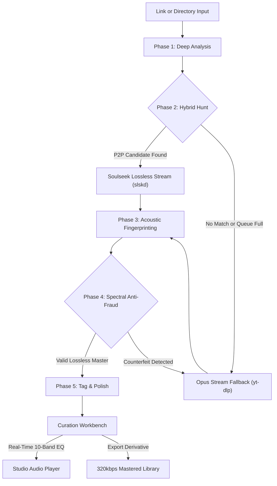

<p align="center">
  
</p>
<p align="center">
  <a href="https://github.com/abdullah-binmadhi/OmniRip/raw/main/docs/assets/omnirip_demo.mp4" title="Click to watch or download the full 1080p video demo with sound">
    
  </a>
</p>

<h1 align="center">OmniRip</h1>

<p align="center">
  <strong>Sound, uncompromising. Handcrafted for your terminal.</strong><br>
  <em>The hybrid P2P audiophile workstation with real-time studio mastering and spectral fraud defense.</em>
</p>

<p align="center">
  <a href="https://github.com/abdullah-binmadhi/OmniRip/raw/main/docs/assets/omnirip_demo.mp4"></a>
  <a href="#quick-start"></a>
  <a href="#the-curation-workbench--10-band-studio-equalizer"></a>
  <a href="#spectral-anti-fraud-intelligence"></a>
  <a href="https://github.com/astral-sh/uv"></a>
</p>

---

## Say hello to OmniRip.

Every once in a while, a tool comes along that completely changes how you listen to music.

For years, listening to digital music has meant making frustrating compromises. If you listen on streaming platforms, songs are often squashed and flattened by heavy compression algorithms so they stream faster over mobile data. And if you try searching peer-to-peer (P2P) file-sharing networks for original CD-quality audio, you often lose hours waiting in long download lines—only to find out that the "lossless FLAC" file you just downloaded was actually a muffled, low-quality 128 kbps MP3 that someone renamed to fool you.

**OmniRip changes everything.**

OmniRip is a complete, all-in-one music workstation designed right inside your terminal. Think of it as a smart music detective and a professional mastering studio rolled into one fast, lightweight app. It searches the **Soulseek P2P** network for original lossless music, automatically falls back to clean web streams if files are unavailable, uses automated **Spectral Anti-Fraud Intelligence** to catch fake high-resolution files, lets you sculpt your sound with a **10-Band Studio Mastering Equalizer**, and restores missing high-end sparkle with an **Acoustic Restoration Engine**.

You do not need to be an audio engineer or a command-line expert to use it. If you love music and want to hear songs the way the artist actually recorded them, OmniRip was built for you.

---

## Five Pillars of Audio Perfection

```
           ┌───────────────────────────────────────────────────────────┐
           │                     THE OMNIRIP ENGINE                    │
           └─────────────────────────────┬─────────────────────────────┘
                                         │
     ┌───────────────────┬───────────────┴───────────────┬───────────────────┐
     ▼                   ▼                               ▼                   ▼
[ 1. P2P HUNT ]   [ 2. ANTI-FRAUD ]              [ 3. REALTIME EQ ]   [ 4. RESTORATION ]
Soulseek Lossless  Spectral FFT                   10-Band Mastering    Sub-fc Invariant
 + Stream Fallback Verification                    Dual-Stream DSP      Harmonic Exciter
```

### 1. Soulseek Lossless Hunt & Opus Stream Fallback
Why settle for compressed web audio when you can have the original studio master?
- **Intelligent Peer Scoring:** When you paste a song link or track title, OmniRip connects to the Soulseek peer-to-peer network. In milliseconds, it inspects every user sharing the song and scores them based on their upload speed, how many people are waiting in line in front of you (queue depth), and file format (giving highest priority to lossless FLAC and WAV, followed by clean 320 kbps MP3s).
- **Queue Guard & Bounded Timeouts:** On P2P networks, popular files often have 100+ people waiting in line. Instead of freezing your computer for hours, OmniRip gives the peer a short countdown. If they do not start uploading quickly, OmniRip immediately activates the **Opus Stream Fallback** via `yt-dlp`. This grabs the cleanest available 160 kbps Opus stream from the web, meaning you always get your music in seconds.
- **Atomic Library Upgrade:** You can point OmniRip at a single song link or ask it to audit an entire folder on your hard drive. OmniRip finds low-bitrate, muffled rips in your collection, hunts down pristine lossless replacements across the network, and safely swaps them into your library without corrupting files or interrupting your music.

### 2. Spectral Anti-Fraud Intelligence: The Fake FLAC Hunter
Anyone on the internet can take a muffled 128 kbps MP3 file, rename its extension to `.flac`, and claim it is "lossless studio quality." File extensions and file sizes can easily lie. OmniRip does not trust filenames:
- **Instantaneous FFT Spectrogramming:** OmniRip takes a mathematical snapshot of the audio waveform across the entire audible spectrum, from deep 20 Hz sub-bass all the way up to 22.05 kHz treble (the highest frequency human ears can detect).
- **Compression Brick-Wall Cutoff Detection ($f_c$):** When audio is compressed into an MP3 to save space, the compression algorithm literally chops off the high frequencies like a guillotine. A 128 kbps MP3 abruptly cuts off all sound above 15 kHz. A 192 kbps MP3 cuts off at 16 kHz. A 256 kbps MP3 cuts off at 19 kHz. A genuine lossless FLAC has continuous, natural musical energy reaching all the way to 22.05 kHz.
- **Zero Tolerance for Impostors:** If a file claims to be a lossless FLAC but OmniRip's spectral analysis discovers a 15 kHz or 16 kHz brick wall, OmniRip catches the counterfeit immediately. It rejects the imposter, purges the fake file, and automatically switches to a clean, verified fallback. You will never have a fake high-res file in your music library again.

### 3. Curation & Enhancement Workbench with 10-Band Studio Equalizer
A professional mixing desk right inside your terminal console. Tweak, audition, and sculpt your sound in real time:
- **Precision 13-Line Vertical Studio Fader Rails:** Press <kbd>w</kbd> to open the workbench. You are greeted by 10 calibrated vertical sliders representing standard octave bands: **31 Hz, 63 Hz, 125 Hz, 250 Hz, 500 Hz, 1 kHz, 2 kHz, 4 kHz, 8 kHz, and 16 kHz**. Each slider can boost or cut frequencies from $-12.0\text{ dB}$ to $+12.0\text{ dB}$ in exact $2.0\text{ dB}$ increments, complete with glowing sliders (`─█─`), a bright yellow center zero mark (`─┼─`) for neutral gain, and $\pm 6\text{ dB}$ reference ticks.
- **Zero-Latency Live DSP Playback:** Adjusting any slider changes what you hear in your headphones in under 50 milliseconds! There is zero waiting and no need to re-encode the file to disk. The equalizer works seamlessly on **both** the **`[1] ♫ MP3`** (Original MP3 Baseband) stream and the **`[2] ✦ ENH`** (Enhanced Derivative) stream. You can flip between the original and enhanced versions with a single keypress to compare how your EQ tweaks sound.
- **Instant Acoustic Presets & Output Protection:** Don't want to adjust sliders manually? Choose from built-in acoustic presets like *Club Punch* (deep, powerful bass kick), *Vocal Clarity* (brings vocals forward), *Hi-Fi Air* (adds silky high-end shimmer), *Warm Vinyl* (smooth vintage tone), and *De-Mud* (cleans up boomy lower frequencies). It also includes a **30 Hz High-Pass Filter (HPF)** to eliminate speaker rumble and an **Output Trim** to prevent audio distortion.

### 4. Acoustic Restoration Engine: Eco DSP vs. Neural AI
What about rare live concert recordings, underground mixtapes, and vintage vinyl rips where no lossless master exists anywhere? OmniRip breathes new life into them without ruining the original performance:
- **Sub-Cutoff Audio Invariance (100% Bit-Exact Preservation):** Many "AI audio upscalers" ruin songs because they alter the entire track, making singers sound robotic and metallic. OmniRip follows a strict golden rule: **it never alters audio below the cutoff frequency ($f_c$)**. The original vocals, bass, drums, and instruments are preserved 100% bit-for-bit.
- **Synthesizing High-Frequency Air (>15.5 kHz):** OmniRip analyzes the musical harmonies of the original track and mathematically generates natural overtone shimmer above the cutoff. It uses a **384-tap linear-phase crossover filter** so no phase cancellation occurs, stabilizes the sub-bass below 100 Hz into solid mono, and protects against distortion with an **ITU-R BS.1770 True-Peak Limiter** set at $-0.1\text{ dBFS}$.
- **Two Restoration Engines to Choose From:**
  - **Eco DSP Mode:** Pure mathematical signal processing using vectorized NumPy algorithms. It runs instantaneously, consumes almost no battery, generates zero computer heat, and works on any laptop without needing a graphics card.
  - **Neural AI Mode:** Uses deep learning residual neural networks (FlashSR and NVSR) to intelligently predict and synthesize acoustic air and sparkle for high-end audiophile headphones and studio monitors.

### 5. Canonical Fingerprinting & Atomic Library Upgrade
Say goodbye to misspelled track titles, missing album art, and corrupt music files:
- **AcoustID Audio Fingerprinting:** Instead of relying on random filenames, OmniRip uses Chromaprint (`fpcalc`) to listen to the song's acoustic fingerprint—just like Shazam. It queries the open MusicBrainz database to retrieve the official canonical song title, artist name, album, release year, genre, and track number.
- **Embedded High-Resolution Album Art:** OmniRip automatically fetches official, high-resolution album covers from the Cover Art Archive and embeds them directly inside the file's ID3v2 tags, so artwork looks sharp on your phone, car display, or home stereo.
- **Crash-Proof Atomic File Swapping:** When updating songs in your local library, OmniRip never writes directly over your existing files. It downloads and masters the replacement into a hidden temporary workspace first. Once the file is 100% verified, it performs an atomic swap on your hard drive. Even if your computer suddenly loses power or crashes, your original files are never left half-written or corrupted.

---

## Interactive Architecture Flow



---

## Quick Start

Experience OmniRip in less than two minutes.

### 1. Prerequisites (macOS shown)
```sh
brew install ffmpeg yt-dlp chromaprint
```

### 2. Install OmniRip
Clone the repository and install using `uv` (recommended) or `pip`:
```sh
git clone https://github.com/abdullahbinmadhi/OmniRip.git
cd OmniRip
uv sync --extra dev
```

### 3. Connect Your Soulseek Account (Recommended)
To hunt lossless FLAC and WAV audio across the Soulseek P2P network:
1. Copy the configuration template:
   ```sh
   cp tools/slskd/slskd.yml tools/slskd/slskd.local.yml
   ```
2. Open `tools/slskd/slskd.local.yml` in any text editor and fill in your Soulseek account username, password, and a secret local API key:
   ```yaml
   soulseek:
     username: your_soulseek_username      # Your standard Soulseek account name
     password: your_soulseek_password      # Your Soulseek password

   web:
     authentication:
       api_key: my_secret_local_key_12345  # A local secret key (or run: openssl rand -hex 32)
   ```

> [!NOTE]
> If you do not have a Soulseek account yet, you can create one for free inside the [SoulseekQt client](http://www.slsknet.org/), or run OmniRip in web-stream-only mode using `./OmniRip --no-slskd`.

### 4. Launch the Studio
Launch the unified TUI:
```sh
./OmniRip
```

> [!TIP]
> **Automatic Background Daemon:** The `./OmniRip` launcher automatically reads your credentials from `tools/slskd/slskd.local.yml`, boots the `slskd` P2P engine in the background if it's not already running, connects to the Soulseek swarm, and opens the workstation immediately.

---

## Keyboard-Driven Studio Mastery

OmniRip is designed for terminal velocity. Keep your hands on the home row:

| Key | Action | Description |
|:---:|:---|:---|
| <kbd>Space</kbd> | **Play / Pause** | Toggle real-time audio playback in the built-in studio player |
| <kbd>1</kbd> | **Audition [1] ♫ MP3** | Switch playback to Original MP3 Baseband stream with live 10-band EQ filtering |
| <kbd>2</kbd> | **Audition [2] ✦ ENH** | Switch playback to Enhanced Derivative stream with live 10-band EQ filtering |
| <kbd>w</kbd> | **Mastering Workbench** | Open the Curation & Enhancement Workbench to tweak EQ and audition modes |
| <kbd>Ctrl</kbd>+<kbd>p</kbd> | **Toggle Mode** | Switch between URL Hunt (Single Track) and Local Batch Audit |
| <kbd>l</kbd> | **Log Cycle** | Cycle log telemetry levels: `INFO` → `DEBUG` → `WARN+ERROR` |
| <kbd>e</kbd> | **Download Enhanced** | Export and download the enhanced, mastered 320 kbps MP3 to your library |
| <kbd>q</kbd> | **Quit** | Gracefully disconnect Soulseek P2P sessions and exit the workstation |

---

## Tech Specs & System Architecture

| Component | Technology | Specification |
|:---|:---|:---|
| **Runtime** | Python ≥ 3.11 | Pure asynchronous event-driven core (`asyncio`) |
| **Interface** | Textual TUI | 60 FPS reactive engine, Cyberpunk Neon & Monokai themes |
| **P2P Transport** | Soulseek (`slskd`) | REST client with queue guards and peer scoring |
| **Stream Engine** | `yt-dlp` | Adaptive format prioritization (`bestaudio[ext=webm]`) |
| **Forensic DSP** | NumPy + SciPy | 2048-point STFT, Hanning window, -60 dBFS noise floor |
| **Mastering EQ** | FFmpeg Live Filter | 10-band octave parametric filters (`width_type=o:w=1`) |
| **Fingerprinting**| Chromaprint (`fpcalc`) | AcoustID audio fingerprinting + MusicBrainz API |
| **Tagging** | Mutagen | Complete ID3v2.4 unicode provenance tagging + album art |

---

## Documentation Deep Dive

For engineers and contributors exploring the internal mechanics:

| Document | Focus |
|:---|:---|
| 📘 [**01. Requirements & Scope**](docs/01-requirements.md) | Functional matrix, acceptance criteria, and edge cases |
| 🏗️ [**02. Core Architecture**](docs/02-architecture.md) | State machine, concurrency pipelines, and data models |
| 🔄 [**03. Pipeline Phases**](docs/03-pipeline.md) | In-depth walkthrough of the 5-phase asynchronous hunt |
| 🔬 [**04. Spectral Anti-Fraud**](docs/04-spectral-antifraud.md) | Mathematical cutoff algorithms and test fixtures |
| 🏷️ [**05. Metadata & Provenance**](docs/05-fingerprinting-metadata.md) | AcoustID, MusicBrainz, and mutagen tagging schemas |
| ⚡ [**06. slskd Integration**](docs/06-slskd-integration.md) | P2P daemon REST integration and candidate ranking |
| 📥 [**07. Stream Fallback**](docs/07-ytdlp-fallback.md) | yt-dlp subprocess strategies and error catalogs |
| 🎨 [**08. TUI Workstation Design**](docs/08-tui-design.md) | Textual widget hierarchy, event throttling, and layout |
| 🛡️ [**09. Testing & Resilience**](docs/09-resilience-testing.md) | Circuit breakers, retry policies, and test matrix |
| 🗺️ [**10. Project Roadmap**](docs/10-roadmap.md) | Milestones M0 through M10 |

---

## Legal & Ethical Architecture

OmniRip is designed exclusively for **personal curation, format-shifting, and acoustic restoration** of content you are legally entitled to obtain (original purchases, your own creations, public domain records, and Creative Commons material). 

OmniRip does not bypass digital rights management (DRM) or circumvent access controls. Operators are responsible for complying with local copyright regulations and platform terms of service.

---

<p align="center">
  <strong>Crafted with obsession for pure sound.</strong><br>
  OmniRip © 2026. Distributed under the MIT License.
</p>
