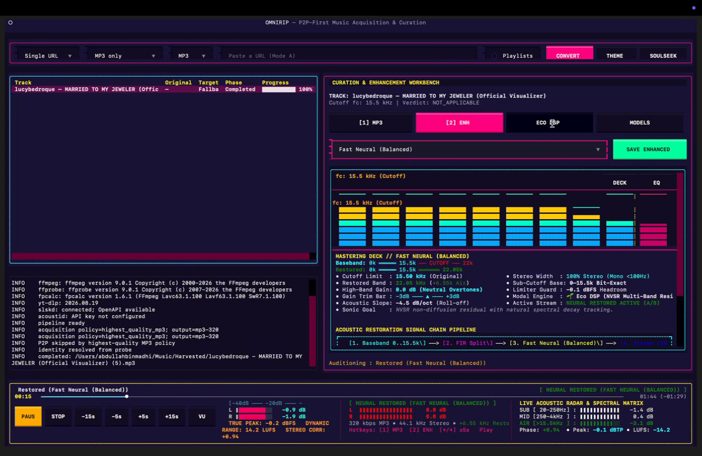
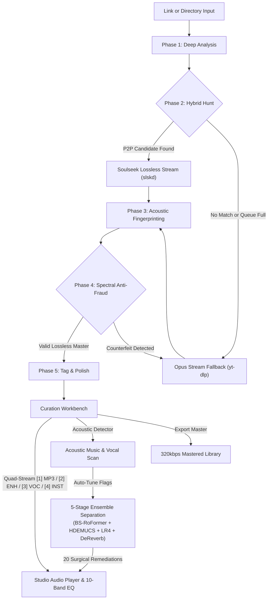

<p align="center">
  
</p>
<p align="center">
  <a href="https://github.com/abdullah-binmadhi/OmniRip/raw/main/docs/assets/omnirip_demo.mp4" title="Click to watch or download the full 1080p video demo with sound">
    
  </a>
</p>

<h1 align="center">OmniRip</h1>

<p align="center">
  <strong>Sound, uncompromising. Handcrafted for your terminal.</strong><br>
  <em>The hybrid P2P audiophile workstation with real-time studio mastering and spectral fraud defense.</em>
</p>

<p align="center">
  <a href="https://github.com/abdullah-binmadhi/OmniRip/actions/workflows/ci.yml"></a>
  <a href="https://github.com/abdullah-binmadhi/OmniRip/raw/main/docs/assets/omnirip_demo.mp4"></a>
  <a href="#quick-start"></a>
  <a href="#the-curation-workbench--10-band-studio-equalizer"></a>
  <a href="#5-5-stage-neural-ensemble-separation-bs-roformer--hdemucs--lr4-studio"></a>
  <a href="#spectral-anti-fraud-intelligence"></a>
  <a href="https://github.com/astral-sh/uv"></a>
</p>

---

## Say hello to OmniRip.

Every once in a while, a tool comes along that completely changes how you listen to music.

For years, listening to digital music has meant making frustrating compromises. If you listen on streaming platforms, songs are often squashed and flattened by heavy compression algorithms so they stream faster over mobile data. And if you try searching peer-to-peer (P2P) file-sharing networks for original CD-quality audio, you often lose hours waiting in long download lines—only to find out that the "lossless FLAC" file you just downloaded was actually a muffled, low-quality 128 kbps MP3 that someone renamed to fool you.

**OmniRip changes everything.**

OmniRip is a complete, all-in-one music workstation designed right inside your terminal. Think of it as a smart music detective and a professional mastering studio rolled into one fast, lightweight app. It searches the **Soulseek P2P** network for original lossless music, automatically falls back to clean web streams if files are unavailable, uses automated **Spectral Anti-Fraud Intelligence** to catch fake high-resolution files, lets you sculpt your sound with a **10-Band Studio Mastering Equalizer**, restores missing high-end sparkle with an **Acoustic Restoration Engine**, and isolates studio-grade acapella and instrumental stems with **Neural Stem Separation**.

You do not need to be an audio engineer or a command-line expert to use it. If you love music and want to hear songs the way the artist actually recorded them, OmniRip was built for you.

---

## Six Pillars of Audio Perfection

```
           ┌───────────────────────────────────────────────────────────────────┐
           │                        THE OMNIRIP ENGINE                         │
           └─────────────────────────────────┬─────────────────────────────────┘
                                             │
      ┌──────────────────────┬───────────────┼───────────────┬──────────────────────┐
      ▼                      ▼               ▼               ▼                      ▼
[ 1. P2P HUNT ]      [ 2. ANTI-FRAUD ] [ 3. REALTIME EQ ] [ 4. RESTORATION ] [ 5. STEM ENSEMBLE ]
Soulseek Lossless     Spectral FFT      10-Band Mastering  Sub-fc Invariant   BS-RoFormer + HDEMUCS
 + Stream Fallback    Verification      Quad-Stream DSP    Harmonic Exciter   LR4 + DeReverb + 20 FX
```

### 1. Soulseek Lossless Hunt & Opus Stream Fallback
Why settle for compressed web audio when you can have the original studio master?
- **Intelligent Peer Scoring:** When you paste a song link or track title, OmniRip connects to the Soulseek peer-to-peer network. In milliseconds, it inspects every user sharing the song and scores them based on their upload speed, how many people are waiting in line in front of you (queue depth), and file format (giving highest priority to lossless FLAC and WAV, followed by clean 320 kbps MP3s).
- **Queue Guard & Bounded Timeouts:** On P2P networks, popular files often have 100+ people waiting in line. Instead of freezing your computer for hours, OmniRip gives the peer a short countdown. If they do not start uploading quickly, OmniRip immediately activates the **Opus Stream Fallback** via `yt-dlp`. This grabs the cleanest available 160 kbps Opus stream from the web, meaning you always get your music in seconds.
- **Atomic Library Upgrade:** You can point OmniRip at a single song link or ask it to audit an entire folder on your hard drive. OmniRip finds low-bitrate, muffled rips in your collection, hunts down pristine lossless replacements across the network, and safely swaps them into your library without corrupting files or interrupting your music.

### 2. Spectral Anti-Fraud Intelligence: The Fake FLAC Hunter
Anyone on the internet can take a muffled 128 kbps MP3 file, rename its extension to `.flac`, and claim it is "lossless studio quality." File extensions and file sizes can easily lie. OmniRip does not trust filenames:
- **Instantaneous FFT Spectrogramming:** OmniRip takes a mathematical snapshot of the audio waveform across the entire audible spectrum, from deep 20 Hz sub-bass all the way up to 22.05 kHz treble (the highest frequency human ears can detect).
- **Compression Brick-Wall Cutoff Detection ($f_c$):** When audio is compressed into an MP3 to save space, the compression algorithm literally chops off the high frequencies like a guillotine. A 128 kbps MP3 abruptly cuts off all sound above 15 kHz. A 192 kbps MP3 cuts off at 16 kHz. A 256 kbps MP3 cuts off at 19 kHz. A genuine lossless FLAC has continuous, natural musical energy reaching all the way to 22.05 kHz.
- **Zero Tolerance for Impostors:** If a file claims to be a lossless FLAC but OmniRip's spectral analysis discovers a 15 kHz or 16 kHz brick wall, OmniRip catches the counterfeit immediately. It rejects the imposter, purges the fake file, and automatically switches to a clean, verified fallback. You will never have a fake high-res file in your music library again.

### 3. Curation & Enhancement Workbench with 10-Band Studio Equalizer
A professional mixing desk right inside your terminal console. Tweak, audition, and sculpt your sound in real time:
- **Precision 13-Line Vertical Studio Fader Rails:** Press <kbd>w</kbd> to open the workbench. You are greeted by 10 calibrated vertical sliders representing standard octave bands: **31 Hz, 63 Hz, 125 Hz, 250 Hz, 500 Hz, 1 kHz, 2 kHz, 4 kHz, 8 kHz, and 16 kHz**. Each slider can boost or cut frequencies from $-12.0\text{ dB}$ to $+12.0\text{ dB}$ in exact $2.0\text{ dB}$ increments, complete with glowing sliders (`─█─`), a bright yellow center zero mark (`─┼─`) for neutral gain, and $\pm 6\text{ dB}$ reference ticks.
- **Zero-Latency Live DSP Playback:** Adjusting any slider changes what you hear in your headphones in under 50 milliseconds! There is zero waiting and no need to re-encode the file to disk. The equalizer works seamlessly across **all four** audition streams: **`[1] ♫ MP3`** (Original Baseband), **`[2] ✦ ENH`** (Restored Derivative), **`[3] ✦ VOC`** (Isolated Vocal Stem), and **`[4] ✦ INST`** (Bleed-Free Instrumental). You can toggle between streams with a single keypress (<kbd>1</kbd>, <kbd>2</kbd>, <kbd>3</kbd>, <kbd>4</kbd>) to sculpt each element individually in real time.
- **Instant Acoustic Presets & Output Protection:** Don't want to adjust sliders manually? Choose from built-in acoustic presets like *Club Punch* (deep, powerful bass kick), *Vocal Clarity* (brings vocals forward), *Hi-Fi Air* (adds silky high-end shimmer), *Warm Vinyl* (smooth vintage tone), and *De-Mud* (cleans up boomy lower frequencies). It also includes a **30 Hz High-Pass Filter (HPF)** to eliminate speaker rumble and an **Output Trim** to prevent audio distortion.

### 4. Acoustic Restoration Engine: Eco DSP vs. Neural AI
What about rare live concert recordings, underground mixtapes, and vintage vinyl rips where no lossless master exists anywhere? OmniRip breathes new life into them without ruining the original performance:
- **Sub-Cutoff Audio Invariance (100% Bit-Exact Preservation):** Many "AI audio upscalers" ruin songs because they alter the entire track, making singers sound robotic and metallic. OmniRip follows a strict golden rule: **it never alters audio below the cutoff frequency ($f_c$)**. The original vocals, bass, drums, and instruments are preserved 100% bit-for-bit.
- **Synthesizing High-Frequency Air (>15.5 kHz):** OmniRip analyzes the musical harmonies of the original track and mathematically generates natural overtone shimmer above the cutoff. It uses a **384-tap linear-phase crossover filter** so no phase cancellation occurs, stabilizes the sub-bass below 100 Hz into solid mono, and protects against distortion with an **ITU-R BS.1770 True-Peak Limiter** set at $-0.1\text{ dBFS}$.
- **Two Restoration Engines to Choose From:**
  - **Eco DSP Mode:** Pure mathematical signal processing using vectorized NumPy algorithms. It runs instantaneously, consumes almost no battery, generates zero computer heat, and works on any laptop without needing a graphics card.
  - **Neural AI Mode:** Uses deep learning residual neural networks (FlashSR with harmonic envelope gating and NVSR) to intelligently predict and synthesize acoustic air and sparkle for high-end audiophile headphones and studio monitors.

### 5. 5-Stage Neural Ensemble Separation, De-Reverb & Surgical Remediation Studio
Extract clean acapellas for sampling or generate pristine backing tracks for DJ sets and karaoke. OmniRip features an end-to-end SOTA stem separation and forensic restoration studio built right into the workstation:
- **Dual-Model Ensemble Architecture (BS-RoFormer + HDEMUCS v4):** OmniRip pairs **BS-RoFormer** (Band-Split Rotary Position Attention transformer) for vocal and harmonic isolation (>300 Hz) with **HDEMUCS v4** (Hybrid Demucs) for low-end bass and sub precision (<300 Hz).
- **Phase-Aligned 4th-Order Linkwitz-Riley (LR4) Crossover Recombination:** Combines the two neural models using a zero-phase 24 dB/octave Linkwitz-Riley crossover (`filtfilt`). This achieves a 0 dB completely flat summed magnitude response with no phase distortion, preserving kick drum punch and bass clarity. The crossover frequency can be adjusted in real time in the Workbench (250–500 Hz).
- **Anechoic De-Reverb Isolation Engine:** Uses the dedicated `dereverb_bs_roformer` neural engine to perform dry/reverb STFT spectral decomposition. It strips room reflections, hall acoustics, and artificial reverb tails from vocals, yielding dry acapellas ready for studio re-mixing. De-reverb intensity is continuously adjustable (0%–100%).
- **Residual Inversion 2.0 & Continuous Blend Math:** Rather than a destructive linear fade, OmniRip implements continuous residual-additive blending: $\text{final} = \text{inversion} + w \cdot (\text{model} - \text{inversion})$. Setting the blend to $0\%$ guarantees pure phase-inverted separation (cleanest mathematical isolation with zero vocal bleed). Increasing to $100\%$ layers the full neural instrumental texture over the inversion base.
- **20 Multi-Choice Surgical Stem Remediations (10 Vocal + 10 Instrumental):**
  - **10 Vocal Remediations:** Volume Pumping Fix, De-Robotize (Phase Polish & Anti-Flange), Acoustic Bleed Shield (Synth/Guitar Rejection), Room Reverb Stripper (Tail Decay Suppression), Dynamic De-Esser (5.5k-8.5k Sibilance Tamer), Sub-Plosive Cut (80Hz High-Pass Pop Filter), Silk & Air Exciter (+2.5dB >10kHz Sheen), Chest Warmth & Body (280Hz Fundamental), Phantom Center Pin (Stereo Bleed Collapse), and Presence & Articulation (+2dB 3.2kHz) / Adaptive VAD Gate.
  - **10 Instrumental Remediations:** Kill Ghost Whispers (Side-Vocal Attenuation), Transient Drum Preserver (Snare/Kick Punch), Kick & Bass Center Punch (Mono Sub <120Hz), Pure Phase Inversion (Bit-Exact Subtraction), Formant Bleed Notch (1k-2.8k Vocal Masking), Low-Mid De-Mud (300Hz Boxiness Cut), Sub-Bass Tightener (30Hz Subsonic Cut), Spatial Stereo Widener (Immersion Boost), Cymbal & Air Sparkle (+2.5dB >12kHz), and RMS Leveler & Dip Fix.
  - One-click profile buttons: **`STUDIO`** (calibrated mastering defaults), **`ALL`** (full defense suite), and **`CLEAR`** (bypass).
- **Automated Acoustic Defect Detector:** Built-in acoustic analyzer that measures mid/side dominance, spectral flatness, and vocal core frequency energy. It automatically identifies **Pure Instrumental** tracks to bypass vocal bleed gating and preserves sub-bass punch, or detects vocals and auto-tunes recommended remediation flags and blend weights.
- **5-Model On-Device AI Registry:** Press the **`MODELS`** button in the workbench to inspect and verify all five on-device neural engines (**BS-RoFormer**, **HDEMUCS**, **De-Reverb**, **FlashSR**, and **NVSR**). OmniRip checks local caches, verifies dependencies, reclaims PyTorch Metal memory pools, and automatically downloads missing weights on demand.

### 5b. FL Studio Multi-Track Arrangement & 10 Surgical Stem Edit Operations
Take complete timeline command of separated stems with OmniRip's terminal DAW arrangement studio, inspired by FL Studio:
- **6-Page Studio Layout (<kbd>F1</kbd>–<kbd>F6</kbd>):** A clean full-width workspace with zero screen crowding:
  - **`[F1] ≡ TRACKS & LOGS`**: Live P2P queue, download telemetry, and track inspection.
  - **`[F2] ◈ VISUALIZER`**: Dedicated multi-panel audio visualization studio featuring a dual-channel calibrated VU meter, 10-band octave real-time spectrum analyzer, phase correlation stereo meter, and full-width braille waveform scrubber.
  - **`[F3] ⎈ DECK`**: Mastering deck overview, loudness radar, and anti-fraud spectral diagnostics.
  - **`[F4] 🎚 EQ`**: 10-band studio mastering equalizer with $\pm 12\text{ dB}$ vertical fader rails and real-time DSP auditioning.
  - **`[F5] 𝄢 STEMS`**: 5-stage neural ensemble separation control with Linkwitz-Riley LR4 crossover, de-reverb, and 20 forensic remediations. Includes a one-click **`[ ▤ OPEN IN LAYERS ]`** bridge.
  - **`[F6] ▤ LAYERS`**: FL Studio multi-track arrangement studio with timeline editing and surgical tools.
- **FL Studio Multi-Track Timeline:**
  - **Track Header Cards (24-char width):** Each stem has a dedicated header with track badge, glowing Mute `[●]` LED indicator, Solo `[S]` button, and distinct stem color accents (Vocals: Neon Pink `#ff3399`, Drums: Crimson Red `#ff4444`, Bass: Royal Blue `#3388ff`, Instruments: Amber `#ffaa00`).
  - **3-Row High-Density Braille Waveforms:** Real multi-track arrangement visualizer with per-cell Braille waveform envelopes showing transient activity across time.
  - **Dual Musical Time Ruler:** Displays both musical **Bars & Beats** (e.g. `BAR 1.1`, `BAR 2.1` calibrated to track BPM) and exact wall-clock time (`00:00`, `00:05`, `00:10`).
- **10 Per-Second Surgical DSP Edit Tools:**
  Apply precise mathematical DSP fixes to any individual 1-second cell on any stem:
  - **`[M] MUTE` (<kbd>m</kbd>):** Zeroes amplitude in the selected second.
  - **`[B] BLEED` (<kbd>b</kbd>):** Attenuates sideband vocal/instrument bleed.
  - **`[S] DE-ESS` (<kbd>s</kbd>):** Cuts harsh $5.5\text{–}8.5\text{ kHz}$ sibilance spikes.
  - **`[U] DE-MUD` (<kbd>u</kbd>):** Cuts boomy $250\text{–}400\text{ Hz}$ boxiness.
  - **`[P] PUNCH` (<kbd>p</kbd>):** Transient compressor and dynamic punch exciter.
  - **`[H] DE-HUM` (<kbd>h</kbd>):** 50/60 Hz notch filter plus 30–120 Hz sub-rumble attenuation ($-18\text{ dB}$).
  - **`[A] AIR+` (<kbd>a</kbd>):** High-shelf sheen boost ($+4\text{ dB}$) from $10\text{–}20\text{ kHz}$ for presence and sparkle.
  - **`[C] DE-CLICK` (<kbd>c</kbd>):** Outlier transient derivative spike detector with median interpolation.
  - **`[G] GATE` (<kbd>g</kbd>):** Soft downward expander for low-level noise floors ($< -38\text{ dBFS}$).
  - **`[T] TAME` (<kbd>t</kbd>):** Soft tanh peak compression limiter for hot transients ($> -3\text{ dBFS}$).
  - **`[R] RESET` (<kbd>r</kbd>):** Reverts the selected cell back to the original unedited stem.
- **Coherent Stems-to-Layers Pipeline:**
  - One-click **`[ ▤ OPEN IN LAYERS ]`** button on the `STEMS` page seamlessly loads newly separated stems directly into the multi-track timeline.
  - If stems are not yet separated, the **`[ ⚡ BUILD STEMS ]`** button inside `LAYERS` initiates the neural pipeline on demand.
  - Dedicated mouse-clickable tool buttons on the Layers action bar provide instant access to all 10 surgical operations, plus **`[ 💾 SAVE LAYERS ]`** (exports 320 kbps mastered layer stems with 20 ms clickless crossfades) and **`[ CLEAR ]`**.

### 5c. Processing Presets, Lane Provenance & Instrument Intelligence
The lane grid stops being anonymous — and you stop guessing which stages ran:
- **Three Processing Presets (`[processing] preset`):** `FETCH ONLY` (acquire + tag only — no separation, no lanes, ~0.2 GB), `STANDARD` (4-source neural separation + song-driven lanes, ~1.7 GB, default) and `NEURAL FULL` (adds 6-source guitar/piano lanes, MusicBrainz credits and CLAP tagging, ~2.5 GB). The preset decides *which* stages run; the separator's engine chain only decides *how* they run — and any fallback to the 2-layer eco DSP is announced with a warning, never applied silently.
- **Provenance on Every Lane Row:** each row carries an origin (`separator`, `DSP split`, `6-source model`, `credits only`, `tags only`), a confidence and a plain-language note (`DRUMS [separator, high] · kept whole — no audible split in this song`). Content that is documented or tagged but has no stem — a credited sax, a tagged string section, a second singer — is **listed without an audio row** rather than faked.
- **Song-Driven Lanes (more than 4 rows when the song supports it):** the drum bus splits into `KICK / SNARE / HATS`, the bass bus into `SUB_BASS / BASS`, and the 6-source model adds `GUITAR` / `PIANO` lanes — each gated by a presence test (≥5 % active seconds above −45 dBFS and mean RMS ≥ −50 dBFS), so bleed does not invent rows. A full-band track renders up to 8 lanes.
- **MusicBrainz Credit Inventory (`🏷 CREDITS`):** fingerprints the loaded track (AcoustID → recording MBID) and pulls the documented instrument/vocal credits and singer count — the *authoritative* inventory, cached locally, annotated straight onto the matching lanes.
- **CLAP Instrument/Vocal Tagging:** a zero-shot audio tagger (`laion/clap-htsat-unfused`) scores evenly spaced windows against 12 instrument/vocal prompts and reports what no stem renders (strings, sax, choir, a second voice). Advisory by design: tags only add provenance rows — they never touch the spectral verdict or your file metadata.
- **Hosted Separation, Opt-In Per Track (`☁ HOSTED SEPARATE`):** when the local models are not enough, one button uploads an excerpt to MVSEP, polls the job and files every returned stem as a real lane (`hosted (MVSEP)` provenance). It is deliberately **not** a preset and nothing hosted ever runs on its own — it is the only path that sends audio off your machine, and it only happens when you press the button for a specific track. The returned filename *is* the lane key, so a 4-, 21- or 53-stem model needs no per-model table; sum stems are skipped and unknown names still become lanes.
- **Measured Speakers, Advisory (`👥 SPEAKERS`):** pyannote diarization measures how many voices the audio actually contains and reports `N speakers measured` **next to** the MusicBrainz credit count (`2 singers · 1 speakers measured`), naming credits as authoritative whenever they disagree. It never rewrites credits, never adds or removes a lane, and runs on CPU (Apple MPS fails on this pipeline). Optional: `uv pip install -e '.[diarize]'`.

### 6. Canonical Fingerprinting & Atomic Library Upgrade
Say goodbye to misspelled track titles, missing album art, and corrupt music files:
- **AcoustID Audio Fingerprinting:** Instead of relying on random filenames, OmniRip uses Chromaprint (`fpcalc`) to listen to the song's acoustic fingerprint—just like Shazam. It queries the open MusicBrainz database to retrieve the official canonical song title, artist name, album, release year, genre, and track number.
- **Embedded High-Resolution Album Art:** OmniRip automatically fetches official, high-resolution album covers from the Cover Art Archive and embeds them directly inside the file's ID3v2 tags, so artwork looks sharp on your phone, car display, or home stereo.
- **Crash-Proof Atomic File Swapping:** When updating songs in your local library, OmniRip never writes directly over your existing files. It downloads and masters the replacement into a hidden temporary workspace first. Once the file is 100% verified, it performs an atomic swap on your hard drive. Even if your computer suddenly loses power or crashes, your original files are never left half-written or corrupted.

---

## Interactive Architecture Flow



---

## Quick Start

Experience OmniRip in less than two minutes.

### 1. Prerequisites (macOS shown)
```sh
brew install ffmpeg yt-dlp chromaprint
```

### 2. Install OmniRip
Clone the repository and install using `uv` (recommended) or `pip`:
```sh
git clone https://github.com/abdullahbinmadhi/OmniRip.git
cd OmniRip
uv sync --extra dev --extra restore
```

> [!TIP]
> The `--extra restore` flag installs PyTorch, Demucs, and TorchAudio for on-device Neural Stem Separation (BS-RoFormer & HDEMUCS) and AI Super-Resolution (FlashSR & NVSR). If you prefer a lightweight installation, omit `--extra restore` to run in Eco DSP mode.

### 3. Connect Your Soulseek Account (Recommended)
To hunt lossless FLAC and WAV audio across the Soulseek P2P network:
1. Copy the configuration template:
   ```sh
   cp tools/slskd/slskd.yml tools/slskd/slskd.local.yml
   ```
2. Open `tools/slskd/slskd.local.yml` in any text editor and fill in your Soulseek account username, password, and a secret local API key:
   ```yaml
   soulseek:
     username: your_soulseek_username      # Your standard Soulseek account name
     password: your_soulseek_password      # Your Soulseek password

   web:
     authentication:
       api_key: my_secret_local_key_12345  # A local secret key (or run: openssl rand -hex 32)
   ```

> [!NOTE]
> If you do not have a Soulseek account yet, you can create one for free inside the [SoulseekQt client](http://www.slsknet.org/), or run OmniRip in web-stream-only mode using `./OmniRip --no-slskd`.

### 4. Launch the Studio
Launch the unified TUI:
```sh
./OmniRip
```

> [!TIP]
> **Automatic Background Daemon:** The `./OmniRip` launcher automatically reads your credentials from `tools/slskd/slskd.local.yml`, boots the `slskd` P2P engine in the background if it's not already running, connects to the Soulseek swarm, and opens the workstation immediately.

---

## Keyboard-Driven Studio Mastery

OmniRip is designed for terminal velocity. Keep your hands on the home row:

| Key | Action | Description |
|:---:|:---|:---|
| <kbd>Space</kbd> | **Play / Pause** | Toggle real-time audio playback in the built-in studio player |
| <kbd>F1</kbd>–<kbd>F6</kbd> | **Page Navigation** | Switch studio pages: `[F1]` Tracks & Logs, `[F2]` Visualizer, `[F3]` Deck, `[F4]` EQ, `[F5]` Stems, `[F6]` Layers |
| <kbd>1</kbd> | **Audition [1] ♫ MP3** | Switch playback to Original MP3 Baseband stream with live 10-band EQ filtering |
| <kbd>2</kbd> | **Audition [2] ✦ ENH** | Switch playback to Enhanced Derivative stream with live 10-band EQ filtering |
| <kbd>3</kbd> | **Audition [3] ✦ VOC** | Switch playback to Isolated Studio Acapella / Vocal stem with live 10-band EQ |
| <kbd>4</kbd> | **Audition [4] ✦ INST** | Switch playback to Bleed-Free Instrumental stem with live 10-band EQ |
| <kbd>w</kbd> | **Mastering Workbench** | Open the Curation & Enhancement Workbench to sculpt EQ, stems, and audition modes |
| <kbd>m</kbd> / <kbd>b</kbd> / <kbd>s</kbd> / <kbd>u</kbd> / <kbd>p</kbd> | **Surgical Stem Ops** | Apply Mute, Bleed, De-Ess, De-Mud, or Drum Punch to selected 1-second cell |
| <kbd>h</kbd> / <kbd>a</kbd> / <kbd>c</kbd> / <kbd>g</kbd> / <kbd>t</kbd> | **Advanced Surgical Ops**| Apply De-Hum, Air+, De-Click, Noise Gate, or Transient Tame to selected cell |
| <kbd>r</kbd> | **Reset Cell** | Revert active timeline cell back to unedited stem audio |
| <kbd>x</kbd> / <kbd>z</kbd> | **Mute / Solo Track** | Toggle Mute `[●]` LED or Solo `[S]` state on selected stem track |
| <kbd>↑</kbd> / <kbd>↓</kbd> | **Track Select** | Navigate active stem track in Layers studio |
| <kbd>←</kbd> / <kbd>→</kbd> | **Scrub / Seek** | Scrub playhead across timeline / Move per-second surgical cursor |
| <kbd>+</kbd> / <kbd>-</kbd> | **Stem Texture Blend** | Fine-tune neural stem blend weight ($0\% = \text{Cleanest} \leftrightarrow 100\% = \text{Richest}$) |
| <kbd>Ctrl</kbd>+<kbd>p</kbd> | **Toggle Mode** | Switch between URL Hunt (Single Track) and Local Batch Audit |
| <kbd>l</kbd> | **Log Cycle** | Cycle log telemetry levels: `INFO` → `DEBUG` → `WARN+ERROR` |
| <kbd>e</kbd> | **Download Enhanced** | Export and download the enhanced, mastered 320 kbps MP3 to your library |
| <kbd>q</kbd> | **Quit** | Gracefully disconnect Soulseek P2P sessions and exit the workstation |

---

## Tech Specs & System Architecture

| Component | Technology | Specification |
|:---|:---|:---|
| **Runtime** | Python ≥ 3.11 | Pure asynchronous event-driven core (`asyncio`) |
| **Interface** | Textual TUI | 60 FPS reactive engine, Cyberpunk Neon & Monokai themes |
| **P2P Transport** | Soulseek (`slskd`) | REST client with queue guards and peer scoring |
| **Stream Engine** | `yt-dlp` | Adaptive format prioritization (`bestaudio[ext=webm]`) |
| **Forensic DSP** | NumPy + SciPy | 2048-point STFT, Hanning window, -60 dBFS noise floor |
| **Mastering EQ** | FFmpeg Live Filter | 10-band octave parametric filters (`width_type=o:w=1`) |
| **Neural Ensemble** | BS-RoFormer + HDEMUCS | 5-stage pipeline, zero-phase LR4 crossover, de-reverb, 20 surgical FX |
| **Layer Studio** | FL Studio Timeline | 24-char track headers, Mute/Solo LEDs, 3-row braille waveforms, 10 DSP tools |
| **Acoustic Detector**| Spectral Analysis | Real-time mid/side dominance, tonality, vocal presence auto-tuning |
| **Restoration** | FlashSR + NVSR + Eco | Sub-cutoff bit-exact invariance, 384-tap linear-phase crossover |
| **AI Model Registry**| ModelManager (5 Models) | Automatic download & verification: `bs_roformer`, `hdemucs`, `dereverb`, `flashsr`, `nvsr` |
| **Fingerprinting**| Chromaprint (`fpcalc`) | AcoustID audio fingerprinting + MusicBrainz API |
| **Tagging** | Mutagen | Complete ID3v2.4 unicode provenance tagging + album art |

---

## Documentation Deep Dive

For engineers and contributors exploring the internal mechanics:

| Document | Focus |
|:---|:---|
| 📘 [**01. Requirements & Scope**](docs/01-requirements.md) | Functional matrix, acceptance criteria, and edge cases |
| 🏗️ [**02. Core Architecture**](docs/02-architecture.md) | State machine, concurrency pipelines, and data models |
| 🔄 [**03. Pipeline Phases**](docs/03-pipeline.md) | In-depth walkthrough of the 5-phase asynchronous hunt |
| 🔬 [**04. Spectral Anti-Fraud**](docs/04-spectral-antifraud.md) | Mathematical cutoff algorithms and test fixtures |
| 🏷️ [**05. Metadata & Provenance**](docs/05-fingerprinting-metadata.md) | AcoustID, MusicBrainz, and mutagen tagging schemas |
| ⚡ [**06. slskd Integration**](docs/06-slskd-integration.md) | P2P daemon REST integration and candidate ranking |
| 📥 [**07. Stream Fallback**](docs/07-ytdlp-fallback.md) | yt-dlp subprocess strategies and error catalogs |
| 🎨 [**08. TUI Workstation Design**](docs/08-tui-design.md) | Textual widget hierarchy, event throttling, and layout |
| 🛡️ [**09. Testing & Resilience**](docs/09-resilience-testing.md) | Circuit breakers, retry policies, and test matrix |
| 🗺️ [**10. Project Roadmap**](docs/10-roadmap.md) | Milestones M0 through M10 |
| 🧠 [**11. Neural Model Registry**](docs/11-neural-models.md) | 7-Model on-device AI registry, weights management, PyTorch MPS |
| 🎛️ [**12. Layer Studio & Surgical Edits**](docs/12-layers-studio.md) | FL Studio arrangement timeline, 10 per-second surgical DSP edits |
| 🧬 [**13. Lane Expansion**](docs/13-lane-expansion.md) | Processing presets, lane provenance, MusicBrainz credits, 6-source guitar/piano lanes, CLAP tags, opt-in hosted MVSEP separation, advisory speaker measurement |

---

## Legal & Ethical Architecture

OmniRip is designed exclusively for **personal curation, format-shifting, and acoustic restoration** of content you are legally entitled to obtain (original purchases, your own creations, public domain records, and Creative Commons material). 

OmniRip does not bypass digital rights management (DRM) or circumvent access controls. Operators are responsible for complying with local copyright regulations and platform terms of service.

---

<p align="center">
  <strong>Crafted with obsession for pure sound.</strong><br>
  OmniRip © 2026. Distributed under the MIT License.
</p>
