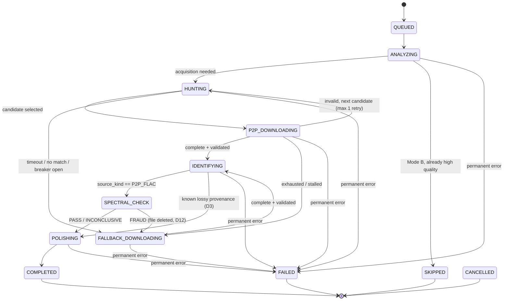

# 02 — Architecture

## 1. Stack decisions (enhancements to the requested stack)

The original brief named the stack below. Where a substitution better serves the "strictly
async, production-ready" directive, the change and rationale are recorded here. This table
is normative.

| Brief requested | Decision | Rationale |
|-----------------|----------|-----------|
| Python 3.11+, asyncio | ✅ Keep | Baseline. `tomllib` in stdlib for config; `asyncio.timeout` (3.11) for deadlines. |
| `textual` | ✅ Keep (latest stable) | Reactive TUI, workers, pilot test harness. |
| `yt-dlp` | ✅ Keep — **run as subprocess**, not in-process `YoutubeDL` API | Process isolation (a crashing extractor can't kill the app), trivial cancellation via process kill, and `pip install -U yt-dlp` fixes YouTube breakage without a code change. |
| `slskd-api` wrapper | ⚠️ Replace with direct REST client (`httpx.AsyncClient`) | slskd's HTTP API is small and version-drifts; a thin typed client + runtime OpenAPI verification (Decision D6) beats depending on an unversioned wrapper. |
| `pyacoustid` | ⚠️ Optional convenience only; primary path is `fpcalc` binary via async subprocess + AcoustID REST via `httpx` | `pyacoustid` is synchronous (requests/subprocess); calling it would require thread-wrapping anyway. Direct calls keep everything async-native and testable. |
| `librosa` / `ffmpeg-python` for FFT | ⚠️ Replace with **ffmpeg subprocess decode → numpy** | librosa is a heavy dependency chain (numba); ffmpeg-python is thinly maintained. A raw `ffmpeg → f32le pipe → numpy STFT` gives full control, minimal deps, and easy unit testing. `scipy` used in tests only (fixture generation). |
| `mutagen` | ✅ Keep | The standard for ID3/FLAC/MP4 tagging. |
| — (new) | `httpx`, `numpy`, `platformdirs` | Async HTTP, spectral math, OS-correct app directories. |

**Final runtime dependencies:** `textual`, `httpx`, `mutagen`, `yt-dlp`, `numpy`,
`platformdirs`. Dev/test: `pytest`, `pytest-asyncio`, `respx`, `scipy`, `soundfile`, `ruff`.
External binaries: `ffmpeg`, `ffprobe`, `fpcalc`, `slskd` (optional).

## 2. Package layout

```
harvester/
├── pyproject.toml
├── config.example.toml
├── README.md                        # quickstart (points at docs/)
├── src/harvester/
│   ├── __init__.py
│   ├── __main__.py                  # entry: python -m harvester [--config path]
│   ├── config.py                    # load/validate TOML + env secrets; dataclasses
│   ├── models.py                    # TrackJob, enums, JobEvent, CanonicalMetadata
│   ├── statemachine.py              # legal transitions (single source of truth)
│   ├── appdirs.py                   # workspace/cache/logs/reports paths (platformdirs)
│   ├── processing.py                # processing presets: which stages run (docs/13 D21)
│   ├── ipc/
│   │   └── layer_sidecar.py         # workbench ⇄ detached terminal channels (docs/12 §6.3)
│   ├── pipeline/
│   │   ├── orchestrator.py          # queues, worker pools, cancellation, shutdown
│   │   ├── phase1_analyze.py        # URL probe / directory scan
│   │   ├── phase2_hunt.py           # P2P search + candidate choice + fallback trigger
│   │   ├── phase3_identify.py       # fpcalc + AcoustID + metadata resolution
│   │   ├── phase4_spectral.py       # anti-fraud gate (P2P lossless only)
│   │   └── phase5_polish.py         # tagging, art, transcode, atomic placement
│   ├── services/
│   │   ├── slskd.py                 # typed REST client + health + circuit breaker hook
│   │   ├── ytdlp.py                 # subprocess wrapper, progress parsing, kill semantics
│   │   ├── ffmpeg.py                # binary detection, decode pipe, transcode, probe
│   │   ├── acoustid.py              # lookup client, rate limiter, SQLite cache
│   │   ├── musicbrainz.py           # Cover Art Archive + recording credits (docs/13 D23)
│   │   ├── mvsep.py                 # hosted separation, opt-in per track (docs/13 D26)
│   │   ├── diarization.py           # pyannote speaker measurement, advisory (docs/13 D27)
│   │   ├── model_manager.py         # model registry: download, cache, checksum (docs/11)
│   │   └── tagging.py               # mutagen write ops (MP3/FLAC/MP4/Opus)
│   ├── analysis/
│   │   ├── titleclean.py            # query normalization (Phase 2)
│   │   ├── scoring.py               # P2P candidate ranking (weights in docs/06)
│   │   ├── spectral.py              # cutoff/brick-wall detector — pure numpy
│   │   └── enhancement/
│   │       ├── stem_separator.py    # BS-RoFormer → HDEMUCS ensemble, 6-source extras, eco fallback
│   │       ├── dynamic_layers.py    # song-driven lanes: splits, extras, presence gates (docs/12 §6)
│   │       ├── lane_plan.py         # lane provenance: origin / confidence / note (docs/13 D22)
│   │       ├── tags.py              # CLAP zero-shot instrument + vocal tags (docs/13 D25)
│   │       ├── layers.py            # LayerTrack assembly + per-second analysis
│   │       ├── layer_editor.py      # the 10 surgical per-second ops + EditPlan
│   │       └── dsp.py               # LR4 crossovers, band splits
│   ├── batch/
│   │   ├── scanner.py               # directory walk + mutagen probe + skip rules
│   │   ├── report.py                # JSONL batch report writer (append-only)
│   │   └── trash.py                 # .trash layout, retention purge, rollback
│   ├── ui/
│   │   ├── app.py                   # HarvestApp(App)
│   │   ├── bridge.py                # JobEvent queue → throttled widget updates
│   │   ├── workbench.py             # 6-page workbench: tracks, visualizer, deck, EQ, stems, layers
│   │   ├── layer_studio.py          # FL-style arrangement grid widget
│   │   ├── layer_terminal.py        # detached layer terminal (docs/12 §6)
│   │   ├── screens/
│   │   │   ├── main.py
│   │   │   ├── dirpicker.py         # DirectoryTree modal
│   │   │   └── notices.py           # first-run legal notice, playlist confirm
│   │   ├── widgets/
│   │   │   ├── statusbar.py         # service pills
│   │   │   ├── jobtable.py          # DataTable subclass + row rendering
│   │   │   └── logconsole.py        # RichLog + level filter
│   │   └── app.tcss
│   └── util/
│       ├── logging_setup.py         # QueueHandler → file + UI; secret masking
│       ├── retry.py                 # backoff, jitter, circuit breaker
│       ├── fsatomic.py              # temp write, fsync, os.replace helpers
│       └── subproc.py               # tracked subprocess registry, kill-all
└── tests/                           # mirrors src layout; see docs/09
```

## 3. Application directories

Resolved via `platformdirs.user_data_dir("harvester")` (override: `--data-dir` /
`HARVESTER_DATA_DIR`):

| Dir | Contents |
|-----|----------|
| `workspace/` | In-flight downloads, keyed `<job_id>.<ext>`; cleaned on completion/cancel/startup |
| `cache/` | `acoustid.sqlite3`, cover art cache keyed by release MBID |
| `logs/` | Rotating file logs (5 × 2 MB) |
| `reports/` | Batch reports `<dirname>-<UTC timestamp>.jsonl` |
| `quarantine/` | Corrupt/invalid P2P downloads kept for debugging (auto-purge 7 days) |

Mode B `.trash/` lives **inside the scanned music directory** (same filesystem — required for
atomic `os.replace`).

## 4. Data model

### 4.1 Enums

```
Mode:          SINGLE_URL | BATCH_AUDIT
State:         QUEUED | ANALYZING | HUNTING | P2P_DOWNLOADING | FALLBACK_DOWNLOADING
               | IDENTIFYING | SPECTRAL_CHECK | POLISHING
               | COMPLETED | SKIPPED | FAILED | CANCELLED        (last four terminal)
SourceKind:    P2P_FLAC | STREAM_OPUS | STREAM_OTHER | NONE
Verdict:       PASS | FRAUD | INCONCLUSIVE | NOT_APPLICABLE
ErrorClass:    see docs/09 §1
```

### 4.2 `TrackJob` (mutable, single-owner: the orchestrator)

| Field group | Fields |
|-------------|--------|
| Identity | `id` (uuid4 hex, 12 chars), `mode`, `state`, `created_at` |
| Input | `input_url` (A), `input_path` (B), `query_raw`, `queries` (cleaned list), `probe_meta` {title, artist, album, duration_s, thumbnail_url, extractor_id} |
| Original (B) | `orig_codec`, `orig_bitrate`, `orig_duration_s`, `orig_size`, `orig_tags` |
| Hunt | `candidates` (ranked list of P2PCandidate), `candidate_cursor`, `selected_candidate`, `p2p_retries` |
| Acquisition | `source_kind`, `workspace_path`, `download` {bytes_done, bytes_total, speed_bps, pct}, `fallback_attempted` (D12) |
| Verification | `canonical_meta` (CanonicalMetadata), `fingerprint_cached` (bool), `spectral` {verdict, cutoff_hz, steepness_db_khz, detail} |
| Output | `output_path`, `trash_path`, `report_row` |
| Control | `progress` {phase_pct, overall_pct}, `error` {class, message, retryable, attempt}, `cancel_requested`, `updated_at` |

### 4.3 `JobEvent` (immutable, UI contract)

`{job_id, seq, kind: STATE|PROGRESS|LOG|ERROR, state?, phase_pct?, download?, level?, text?, error?}`
Events are the **only** channel from pipeline to UI. Services never touch widgets.

### 4.4 State machine



Rules:
- `statemachine.py` holds the only legal-transition table; `TrackJob.set_state()` raises
  `IllegalTransition` otherwise (unit-tested exhaustively).
- Every non-terminal state can also transition to `CANCELLED` (user) or `FAILED`
  (non-retryable / retries exhausted).
- **Anti-loop invariant (D12):** once `fallback_attempted` is true, transitions into
  `HUNTING` or `SPECTRAL_CHECK` are illegal.

## 5. Concurrency model

One asyncio event loop — **Textual's** — runs everything. The orchestrator is launched as a
single exclusive async worker (`App.run_worker(..., exclusive=True, group="pipeline")`).

### 5.1 Stage queues & worker pools

Pipeline-as-queues: each phase is a stage with a bounded `asyncio.Queue` in front of it and
N worker coroutines behind it. A job flows stage → stage; workers pull, transition state,
emit events, push onward (or to the fallback/failed lane).

| Stage queue | Workers (default) | Blocking concerns | Notes |
|-------------|-------------------|-------------------|-------|
| `q_analyze` | 2 | yt-dlp probe = subprocess; mutagen = file I/O → `to_thread` | Mode B scan emits many jobs; scan itself runs in one worker streaming into the queue |
| `q_hunt` | 2 | pure HTTP (httpx async) | Multi-query budget shared per job (25 s) |
| `q_p2p_dl` | 2 | polling only (slskd does the transfer) | Stall detection per docs/09 §4 |
| `q_fallback_dl` | 2 | subprocess + stdout parsing | Kill on cancel/stall |
| `q_identify` | 1 | fpcalc subprocess; AcoustID HTTP | Single worker + token-bucket (3 req/s) trivially enforces AC-9 |
| `q_spectral` | 1 | CPU: STFT via `to_thread` (D8) | 60 s excerpt keeps it ≤ 3 s |
| `q_polish` | 2 | ffmpeg subprocess; mutagen via `to_thread` | Atomic placement here (fsync) |

Queue `maxsize` = 4 × workers, except `q_analyze` (unbounded producer side, capped by
playlist/scan limits). Backpressure: a full queue makes the upstream worker `await put()`.

### 5.2 Thread/process offload rules

| Work | Mechanism |
|------|-----------|
| Subprocesses (yt-dlp, ffmpeg, fpcalc) | `asyncio.create_subprocess_exec`, stdout/stderr drained concurrently (deadlock-safe), registered in `subproc.registry` for kill-all |
| mutagen read/write, file moves, hashing | `asyncio.to_thread` |
| numpy STFT (spectral) | `asyncio.to_thread` (D8); escalate to `ProcessPoolExecutor(max_workers=1)` if UI lag measured |
| SQLite cache (AcoustID) | `asyncio.to_thread`, WAL mode, single writer |

**Forbidden on the loop:** `requests`, `time.sleep`, synchronous `subprocess.run`, direct
file reads > ~64 KB, librosa-style heavy CPU. Enforced in review; `PYTHONASYNCIODEBUG=1`
in dev catches slow callbacks.

### 5.3 Cancellation & shutdown

- Each job carries a `cancel_requested` flag; workers check it between awaits and abort the
  stage (killing tracked subprocesses).
- App quit / SIGTERM → `orchestrator.shutdown()`: set stop event → cancel worker tasks →
  `subproc.kill_all()` (terminate, 5 s grace, then kill) → drain queues dropping pending
  jobs as CANCELLED → final UI flush. In-flight temp files removed; `.trash/` never touched.

## 6. Configuration

Load precedence: **CLI flags > environment > config file > built-in defaults**.
File: `config.toml` (path via `--config`; default `user_data_dir/harvester/config.toml`).

```toml
[general]
output_dir = "~/Music/Harvested"   # Mode A destination
log_level_file = "DEBUG"
log_level_ui = "INFO"
first_run_notice_accepted = false

[slskd]
enabled = true
url = "http://localhost:5000"
api_key_env = "SLSKD_API_KEY"      # name of env var holding the key
download_dir = "~/Music/slskd"     # daemon's configured download dir (for file handoff)
search_timeout_s = 25
poll_interval_s = 1.5
max_concurrent_downloads = 2
verify_openapi = true              # D6

[acoustid]
api_key_env = "ACOUSTID_API_KEY"
rate_limit_per_s = 3
cache_ttl_days = 90

[ytdlp]
binary = "yt-dlp"                  # or "python -m yt_dlp"
format = "bestaudio[acodec^=opus]/bestaudio/best"
cookies_from_browser = ""          # e.g. "chrome" — user's own risk, see docs/07 §10
stall_timeout_s = 90
total_timeout_s = 900

[ffmpeg]
binary = "ffmpeg"
probe_binary = "ffprobe"
transcode = "mp3-320"              # "mp3-320" | "mp3-v0" | "keep-opus"   (D2)

[spectral]
enabled = true
excerpt_s = 60
strict = false                     # INCONCLUSIVE → PASS (false) or fallback (true)

[batch]
skip_bitrate_kbps = 256            # D1
playlist_cap = 50                  # D10
rename_to_canonical = false        # D4
trash_retention_days = 7           # D5
auto_purge_trash = false

[ui]
refresh_hz = 8
max_log_lines = 2000
```

Secrets: `SLSKD_API_KEY`, `ACOUSTID_API_KEY` from environment only. Config stores the *env
var name*, never a value. The logging masker (`util/logging_setup.py`) redacts anything
matching configured key values. A gitignored `.env` next to the config (or at
`OMNIRIP_ENV_FILE`) is loaded into the process environment at startup for launches that do not
inherit shell exports; already-set environment variables always win (docs/01 D20).

## 7. Logging & observability

- stdlib `logging`; root logger `harvester`.
- One `QueueHandler` fans out to: `RotatingFileHandler` (DEBUG, 5 × 2 MB) and the UI bridge
  (INFO+, rendered into `RichLog`).
- Every record from pipeline code carries `extra={"job_id": ..., "phase": ...}`; the UI
  prefixes `[job 3f2a] PHASE2` for traceability.
- Log format (file): `%(asctime)s %(levelname)s %(name)s job=%(job_id)s %(message)s`.
- Service status changes (slskd up/down, circuit state) logged at WARNING/INFO and surfaced
  as UI pills.

## 8. Runtime environment detection (startup)

Sequential checks in `appdirs`-independent `services/*` modules, results cached:

| Check | Method | Failure behavior |
|-------|--------|------------------|
| ffmpeg/ffprobe | `shutil.which` + `ffmpeg -version` (to_thread) | **Hard stop**: launch screen with install instructions (NFR-4) |
| fpcalc | `shutil.which` + `fpcalc -version` | Warn; Phase 3 uses metadata fallback chain |
| yt-dlp | `shutil.which` + `--version` | Hard stop (no acquisition possible); warn if version older than 30 days |
| slskd | `GET {url}/api/v0/session` with API key | Degraded mode (FR-6): pill red, hunts fast-fail to fallback |
| AcoustID key | env var presence | Warn; FR-8 fallback chain (AC-10) |

## 9. Design invariants (checklist for every PR)

1. The state machine is the single source of truth; UI renders states, never infers them.
2. No blocking call on the event loop (§5.2 forbidden list).
3. Every subprocess is registered, killable, and has stall + total timeouts.
4. Every library-bound file write goes: temp file → fsync → `os.replace`.
5. Every network call has an explicit timeout from the registry (docs/09 §4).
6. Secrets exist only in environment variables; logs are masked.
7. Pipeline → UI communication is exclusively via `JobEvent` queues.
8. A job touches the user's existing library files only in Phase 5, only via the atomic
   swap, only after all verification passed.
