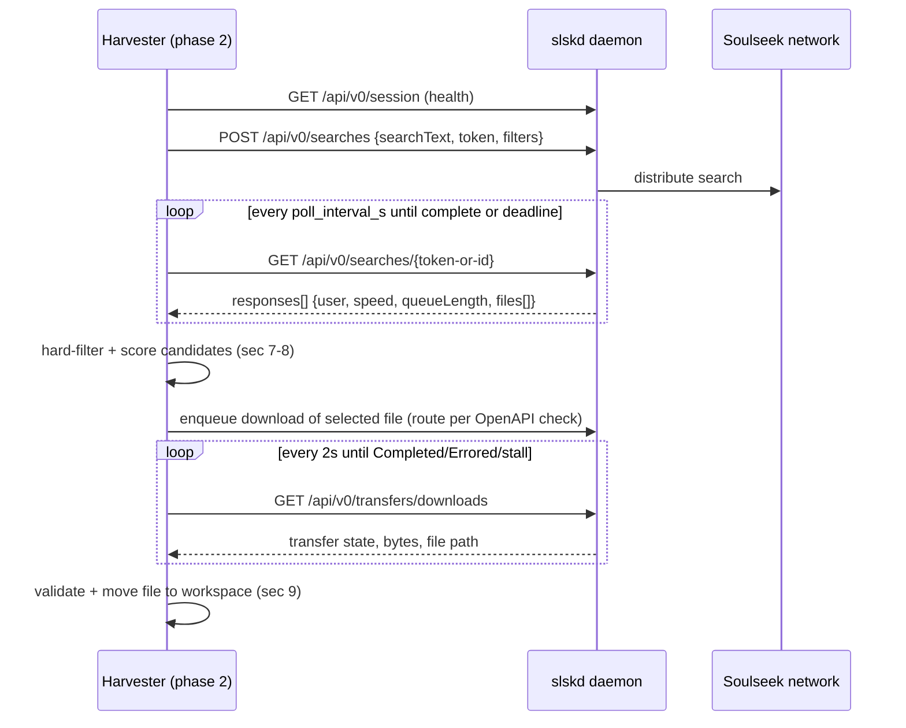

# 06 — slskd Integration (Soulseek P2P lane)

`slskd` is a headless Soulseek daemon exposing a REST API + web UI. Harvester talks only to
the daemon — never to the Soulseek network directly. This doc specifies the client in
`services/slskd.py`, candidate scoring (`analysis/scoring.py`), and resilience behavior.

## 1. Prerequisites (user-side, checked at startup)

1. slskd running locally (native binary or Docker) with a **logged-in** Soulseek account.
2. A download directory configured in slskd (harvester reads completed files from there).
3. An API key issued by slskd, exported as env `SLSKD_API_KEY` (config stores the env-var
   name only — NFR-6).

Indicative Docker setup (verify current image/env names against the official slskd docs —
they evolve):

```
docker run -d --name slskd \
  -p 5000:5000 \
  -v ~/Music/slskd:/downloads \
  -e SLSKD_SOULSEEK_USERNAME=<user> \
  -e SLSKD_SOULSEEK_PASSWORD=<pass> \
  slskd/slskd:latest
```

Native: install per slskd releases; minimal `slskd.yml`:

```yaml
soulseek:
  username: <user>
  password: <pass>
directories:
  downloads:
    download: /downloads/complete
    incomplete: /downloads/incomplete
urls:
  bind: http://0.0.0.0:5000
authentication:
  api_keys:
    - name: harvester
      key: <random-64-hex>       # same value goes into SLSKD_API_KEY env
```

## 2. Client fundamentals

- `httpx.AsyncClient(base_url=cfg.url, headers={"X-API-Key": key}, timeout=httpx.Timeout(10))`.
- **OpenAPI verification at startup (D6):** `GET /swagger/v0/swagger.json`; assert the paths
  this client uses exist; extract and log the daemon version. Mismatch → slskd lane
  disabled with a precise error ("your slskd exposes /api/v1 — harvester expects /api/v0
  routes X, Y, Z").
- Health: `GET /api/v0/session` → connection state (`Connected` required for hunting;
  `Disconnected`/`Connecting` → degraded mode, pill yellow/red).

> ⚠️ Route names below reflect slskd's v0 API at writing time. The startup OpenAPI check is
> the authority; treat this table as the expected shape, not a guarantee.

## 3. Core flow



### 3.1 Search request

- Body: `{"searchText": q, "token": <unique random int32>, ...}` plus response filters if
  the daemon's schema supports them (e.g. minimum peer speed, filter responses) — discover
  field names from the OpenAPI doc at startup; degrade gracefully when absent.
- Unique token per query; keep a `token → job_id/query` map for polling.
- Poll `GET /api/v0/searches/{token}` (or `/{id}` per schema) every `poll_interval_s`
  (1.5 s). Stop on `isComplete` or when the shared 25 s budget (docs/03 §2.1) expires —
  then cancel the search (`DELETE`) to be polite.

### 3.2 Fields consumed per response

| Level | Fields (names per schema) | Use |
|-------|---------------------------|-----|
| Response | `user`, `speed` (kbps), `queueLength`, `uploadCount`/`fileCount` if present, `isPrivileged`/trusted flags if present | scoring |
| File | `filename`, `size`, `bitrate`, `duration`, `sampleRate`, `bitDepth`, `isVariableBitRate` | hard filters + scoring |

Missing numeric attributes → fall back to filename/extension heuristics and size sanity
(docs/03 §2.2).

### 3.3 Download lifecycle

1. Enqueue the selected `(user, filename, token)` download via the route discovered in the
   OpenAPI check (recent slskd versions expose a user-scoped download POST; verify).
2. Poll `GET /api/v0/transfers/downloads` every 2 s; match our transfer by user + filename.
3. Track `bytesTransferred` between polls: **stall = zero progress for 120 s** (registry,
   docs/09 §4) → cancel transfer, next candidate or fallback lane.
4. States: `Completed` → locate file under `slskd.download_dir` (daemon preserves
   user/path structure) → validate → **move** (copy+unlink across devices) to
   `workspace/<job_id>.flac`. `Errored`/`Cancelled` → next candidate.
5. Never delete files inside slskd's tree other than our own moved artifacts; leave
   incomplete files to slskd's own cleanup.

## 4. Concurrency & politeness

- Max `slskd.max_concurrent_downloads` (2) active file transfers across all jobs
  (semaphore in the client). slskd enforces its own limits too; ours prevents queue floods.
- Max 3 searches per job (docs/03 §2.1); always cancel searches when abandoning them.
- One download attempt per candidate; max 1 candidate retry per job (FR-5).

## 5. Circuit breaker (docs/09 §3)

- Connection-level failures (connect refused/timeout on health or any call): 3 consecutive
  → breaker OPEN 60 s → all hunts fast-fail to the fallback lane immediately (FR-6);
  HALF-OPEN probe = one `GET /session`; success → CLOSED.
- Breaker state is a UI pill and logged at WARNING on every transition.
- `slskd.enabled = false` behaves like a permanently open breaker (yt-dlp-only mode).

## 6. Error mapping

| Situation | ErrorClass (docs/09 §1) | Action |
|-----------|--------------------------|--------|
| Connect refused / DNS / 5xx | ServiceUnavailable | count toward breaker; hunt fast-fails → fallback |
| 401/403 (bad API key) | ConfigError | slskd lane disabled + explicit UI message (no retries) |
| Search completes, zero candidates | — (normal) | next query or fallback |
| Transfer Errored/Cancelled | TransientNetwork | next candidate once → fallback |
| Stall (120 s no bytes) | TransientNetwork | cancel transfer → next candidate/fallback |
| Completed file fails validation (docs/03 §2.3) | ValidationError | quarantine → next candidate/fallback |
| File vanished from download dir | ValidationError | log, next candidate/fallback |

## 7. Hard filters (recap; normative in docs/03 §2.2)

extension `.flac` → reported `bitDepth ≥ 16` when present → size sanity 0.85–1.30×
expected → duration ±5% when known. Everything else is dropped before scoring.

## 8. Candidate scoring (`analysis/scoring.py`)

Deterministic, pure function over a normalized `Candidate` record; unit-tested with canned
slskd payloads. Weights (sum ≈ 100; tune with tests, not vibes):

| Criterion | Points |
|-----------|--------|
| `bitDepth == 24` | +10 (16-bit: +0) |
| `sampleRate ≥ 44100` | +5 |
| User speed ≥ 1000 kbps | +15; 300–999: +8; < 300: 0 |
| `queueLength == 0` | +10; 1–3: +5; > 10: −10 |
| `uploadCount ≥ 1000` | +10; ≥ 100: +6; unknown: +2 |
| Size within ±5% of expected | +10; ±15%: +4 |
| Duration match within ±1% of probe | +8; ±5%: +3 |
| Privileged/trusted flag (if schema exposes it) | +5 |
| Filename hygiene: shallow path, no spam tokens (`transcode`, `mp3`, `320`, `lame`, `www.`) | +5 / −20 on spam hit |
| VBR flag set on a "FLAC" (schema inconsistency) | −25 |

Ties broken by (higher uploadCount, then random with job-seeded RNG for reproducibility).

## 9. File handoff & safety

- Compute `sha1` of the moved workspace file; store in the job (dedup D11, report row).
- Cross-device moves: `shutil.move` with copy+unlink fallback; verify size after move.
- The slskd download dir is treated as **read-only** except for removing our completed
  artifact after a successful move (configurable `slskd.leave_files = true` default **true**
  — leave the daemon's tree untouched; disk space is the user's call).
- Quarantine (not delete) files failing validation, for debugging (NFR-5).

## 10. Degraded-mode UX contract

When the lane is unavailable (disabled, breaker open, session disconnected):

- Header pill: red (`slskd ✗`) with hover/expand reason string from the last error.
- Phase 2 emits a single INFO event per job: "P2P unavailable (reason) → stream fallback".
- No retry storms: health re-probe only via the breaker's half-open cycle and the UI's
  10 s status poller (docs/08 §6).
