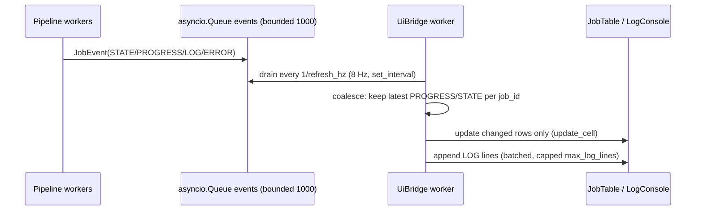

# 08 — TUI Design (Textual)

Specifies `ui/`: layout, widgets, event flow, throttling, keybindings. Hard rule (NFR-1/
FR-16): the pipeline and services never touch widgets — everything flows through `JobEvent`
queues and the UI bridge.

## 1. Layout

```
┌────────────────────────────────────────────────────────────────────────────┐
│ ⬢ HARVESTER   slskd ●  ffmpeg ●  fpcalc ●  acoustid ▲   jobs 12/14  ⏐ q  │ ← StatusBar
├────────────────────────────────────────────────────────────────────────────┤
│ Mode [A: URL ▾ / B: Directory]  ┌──────────────────────────────────┐ [GO] │ ← InputRow
│                                 │ https://…  or  /path/to/music    │ [⋯]  │
│                                 └──────────────────────────────────┘      │
├────────────────────────────────────────────────────────────────────────────┤
│ Track            │ Original   │ Target    │ Phase        │ Progress       │
│ Daft Punk - One… │ —          │ P2P FLAC  │ Spectral     │ ▰▰▰▰▰▱▱▱▱▱ 48% │
│ 03 - Around t…   │ mp3 128k   │ fallback  │ Downloading  │ ▰▰▰▱▱▱▱▱▱▱ 31% │ ← JobTable
│ Pink Floyd - …   │ flac       │ —         │ Skipped      │ —              │
│ …                │            │           │              │                │
├────────────────────────────────────────────────────────────────────────────┤
│ 12:04:11 INFO  [3f2a] PHASE2  q1 "Daft Punk - One More Time" → 7 cand.    │
│ 12:04:13 WARN  [9c11] PHASE4  FRAUD cutoff=16.0kHz S=38dB/k → fallback     │ ← LogConsole
│ 12:04:20 INFO  [3f2a] PHASE3  AcoustID hit score=0.94 (rec 8f2c…)          │
├────────────────────────────────────────────────────────────────────────────┤
│ ^p mode  enter submit  c cancel  C cancel-all  l log-level  ^q quit        │ ← Footer
└────────────────────────────────────────────────────────────────────────────┘
```

Grid (TCSS): 3 rows — `dock-top` StatusBar (1 line), middle container split
InputRow (3 lines) / JobTable (flex 3) / LogConsole (flex 2, min 5 lines), Footer docked
bottom. Splits via `Grid`/`Vertical` containers; JobTable and LogConsole separated by a
draggable `HorizontalRule`-style border. Reasonable minimum terminal: 100×30; below that,
columns truncate (DataTable handles) — no crash.

## 2. Widget inventory

| Area | Widget | Notes |
|------|--------|-------|
| StatusBar | custom `Static` composite | Title + service pills + job counter (done/total) |
| InputRow | `Select` (mode), `Input`, `Button` (GO), `Button` (⋯ browse → DirectoryPicker modal) | Mode B swaps the Input placeholder to a path and enables ⋯ |
| JobTable | `DataTable` subclass `jobtable.py` | Fixed columns; cursor select for cancel; virtualized by DataTable itself |
| LogConsole | `RichLog` subclass | Level filter state (INFO/DEBUG/WARN+ERROR), auto-scroll unless user scrolled up |
| DirectoryPicker | modal `Screen` with `DirectoryTree` + path `Input` + Select button | Textual has **no OS-native dialog** — this is the picker; starts at config output_dir or `~` |
| FirstRunNotice | modal `Screen` | Legal/ToS notice (docs/01 §8); accept persists `general.first_run_notice_accepted` |
| PlaylistConfirm | modal `Screen` | Shows entry count + cap before expanding (D10) |
| QuitConfirm | modal `Screen` | Only when active jobs exist (FR-17) |

## 3. Event flow & throttling



Rules:
- Queue full → drop **oldest PROGRESS** events first (never drop STATE/ERROR; they are
  coalesced-latest per job anyway).
- Table rows created on first STATE=QUEUED event; cell updates only for changed columns
  (track a per-row render hash — avoid full-table redraws).
- Row cap: 500 visible jobs; Mode B batches beyond that page the table (summary row shows
  `+N more`; full data in report JSONL).
- LOG lines: batch-append per flush; trim to `ui.max_log_lines` (2000).
- No widget mutation outside the bridge (invariant 7, docs/02 §9) → thread-safety is
  trivial: only the app's loop touches widgets.

## 4. JobTable columns & rendering

| Column | Content | Width |
|--------|---------|-------|
| Track | `canonical title — artist` when known, else query/title; Mode B prefix `📁` | flex |
| Original | Mode B: `mp3 128k` style (`codec kbps`); Mode A: `—`; skipped: dim | 12 |
| Target | `P2P FLAC` / `Fallback MP3` / `Fallback Opus` / `—` | 13 |
| Phase | Human state (map: HUNTING→Hunting, P2P_DOWNLOADING→P2P download, SPECTRAL_CHECK→Spectral, …) + fraud badge `⚠FRAUD→` when rerouted | 14 |
| Progress | unicode bar + pct: download pct in download states, phase pct otherwise; terminal states: `✔` (COMPLETED, success style), `⏭ SKIPPED` (dim), `✖ FAILED` (error style), `⦸ CANCELLED` | 18 |

Bar renderer: 10 cells `▰`/`▱` + right-aligned pct. Styling via **TCSS classes**
(`.ok`, `.err`, `.warn`, `.dim`, `.fraud`) bound to Textual theme variables — never
hardcoded hex colors, so light/dark themes both work.

## 5. Interactions & keybindings

| Key | Action |
|-----|--------|
| `Tab` / `Shift+Tab` | Focus cycle (mode select → input → GO → table → log) |
| `Enter` (input focused) | Submit (Mode A: URL; Mode B: path) → validation errors inline under input |
| `Ctrl+P` | Toggle mode A/B |
| `c` | Cancel job under table cursor (sets `cancel_requested`; FR-17) |
| `C` | Cancel all active jobs |
| `l` | Cycle log filter: INFO → DEBUG → WARN+ERROR |
| `p` | Purge `.trash/` older than retention (confirm modal) |
| `r` | Re-run FAILED jobs selected in table |
| `Ctrl+Q` | Quit (QuitConfirm modal if jobs active → orchestrator shutdown, docs/02 §5.3) |
| `?` | Help overlay (shortcuts + degraded-mode explanation + D2 honesty note) |

## 6. Service status worker

- `set_interval(10s)` exclusive worker: probes in parallel — slskd `GET /session`
  (5 s timeout; respects breaker state instead of probing when OPEN), ffmpeg/fpcalc
  presence cached (re-check only on config reload), AcoustID key env presence, yt-dlp
  version age (re-check hourly).
- Pills: `●` ok (success style) / `▲` degraded-optional (warning: fpcalc or acoustid
  missing → metadata fallback chain active) / `✗` unavailable (error: slskd down,
  ffmpeg missing) / `⏻` disabled by config (dim).
- Clicking a pill (or `?` help) shows the last error detail.

## 7. App lifecycle

- `on_mount`: load config → run env detection (docs/02 §8; ffmpeg missing → replace screen
  with a `FatalSetupScreen` showing install instructions) → show FirstRunNotice if not
  accepted → start orchestrator worker (`run_worker(orchestrator.run(), exclusive=True,
  group="pipeline")`) → start UiBridge + status workers.
- Worker crashes: `WorkerFailed` handler → log traceback to file, ERROR line to console,
  banner "pipeline halted — see logs"; app stays usable for inspection; `r`-restart
  offered when the failure is non-config.
- `on_unmount` / quit path: `orchestrator.shutdown()` awaited with a 10 s cap; then exit.

## 8. Mode B specifics in the UI

- DirectoryPicker result fills the Input; `GO` triggers the scan worker; a scan progress
  line streams into the LogConsole (`scanned 412 files, queued 57, skipped 355…`).
- Confirmation modal for batches > 25 jobs (docs/03 §1B.5): shows queued count, disk
  estimate, output behavior ("originals → .trash/, kept 7 days").
- Batch completion toast + report path printed in log and shown in a summary modal
  (upgraded/failed/skipped counts).

## 9. Testability (Textual pilot)

- `async def with App.run_test() as app:` scenarios (docs/09 §7): submit URL with a stub
  orchestrator → assert row appears with QUEUED then ANALYZING; inject JobEvents → assert
  coalescing (≤ 8 flushes/s) and cell contents; `c` on selected row → assert
  `cancel_requested`; degraded slskd → assert pill `✗` and fast-fail log line.
- All UI logic lives in widgets/bridge (no service imports) so pilots never need network.
